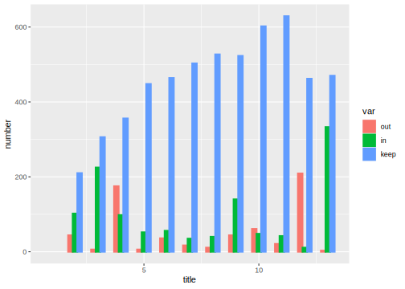
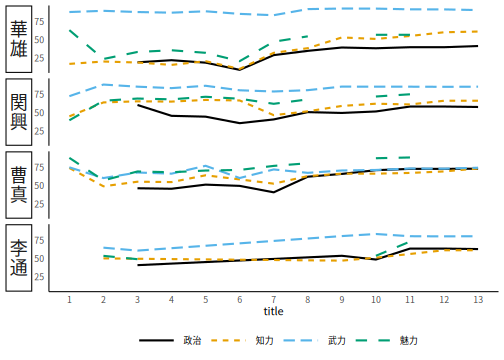

# 概要 {-}

この記事は 2019/12/7 に開催された Japan.R の発表原稿をもとに作成した資料である.

この記事の目的は2つ.

1. 日本語資料の流入によって, 『三国志演義』以外の観点から登場人物の再評価が進んだことが, コーエーテクモのゲームシリーズ『三國志』にどのような影響を与えているかをデータに基づく分析で示す
2. 実際の作業の流れに沿って, 使用したRのコードを解説することで「Rを使ったデータ分析のチュートリアル」としても使えるような構成にする

ここでいう「データ分析」とは, なるべく複雑高度なテクニックを乱用せず必要最小限の方法で何かを言おうというものである. 今回の「データ分析」はスクレイピングによるデータ取得, データの加工整形, 要約統計量の計算, グラフによる視覚化, というよくあるデータ分析のアプローチであり, 使っているパッケージも`rvest`(スクレイピング), `tidyr`と `dplyr`(データの加工整形),`ggplot2`(グラフ作成)など様々な場面で使われるRの代表的なパッケージばかりで, 一部を除き高度な知識や専門性を要求するものではない. 個別のパッケージの使い方であれば, 公式リファレンスその他のより詳しい資料があるため, 今回はデータ分析の流れを意識できるように説明するというのが今回の狙いである.

当初は 5分間のLTの予定だったので要約統計量 (記述統計量) の見方とかを話すつもりだったが, 20分枠に変更されたことに合わせてボリュームを増そうとしたら急に三国志を題材にすることを思いついたのでバランスが狂った感じになった.

\BeginKnitrBlock{rmdtip}<div class="rmdtip">今回の内容は[花園明朝B](https://fonts.jp/hanazono/)をインストールしていないと表示できない文字がある. フォントをインストールするか. フォントを埋め込んだpdf版を閲覧することを推奨する.</div>\EndKnitrBlock{rmdtip}

\BeginKnitrBlock{rmdtip}<div class="rmdtip">教材として洗練させるため, 発表時の内容から一部変更している.</div>\EndKnitrBlock{rmdtip}

\BeginKnitrBlock{rmdtip}<div class="rmdtip">本記事のソースおよびプログラム全文は以下で公開している

https://gedevan-aleksizde.github.io/Japan.R2019/</div>\EndKnitrBlock{rmdtip}


#### キーワード {-}

三國志, スクレイピング, 名寄せ処理, 自然言語処理 (?), 画像認識, ディープラーニング , 計量距離学習, 多変量解析

<a rel="license" href="http://creativecommons.org/licenses/by-sa/4.0/"></a><br />この 作品 は <a rel="license" href="http://creativecommons.org/licenses/by-sa/4.0/">クリエイティブ・コモンズ 表示 - 継承 4.0 国際 ライセンス</a>の下に提供されています.


\mainmatter

# イントロダクション

## 三国志の背景

そこで今回取り上げる「三国志」について, 簡単に解説する.

魏から西晋の時代の歴史家である陳寿によって著された, 魏書・呉書・蜀書のいわゆる三国時代の歴史書を総称して三国志, 通称『正史三国志』と呼ばれる. これは正史, つまり当時の王朝によって正統な歴史書と認定された書物であるから, 必ずしも「真実」が描かれているとは限らない. 現在に残る正史三国志は, 南朝時代の裴松之の註解が付されており, 王朝が変わった後世ということもあってより政権に対して批判的である.

『三国志演義』とは正史三国志や, それにまつわる無数の民間伝承や演劇「三国志平話」を羅貫中が編纂したものである. 本場である中国ではそれ以降も多くのバージョンが作られ, 主要な底本も複数存在する. 20世紀になってからも『反三国志』[@Zhou1919]といったメタフィクション作品が作られている. 三国志演義の成立史だけでも膨大な研究が存在するはずだが, ここではそれに触れない.

@watanabe2011 によれば, 三国志演義の「演義」とは, 義を演繹する, 義を敷衍するという意味であり, 当時の中国における倫理とされていた儒教に規定される道徳心を民衆に教えるという意図がある. よって, 当時の社会情勢や政権の意図が大きく反映されており, 道徳に悖る行動をした人物はみじめに破滅し, 道徳に則った行動を取るものは讃えられるという勧善懲悪の筋書きになっている[^1]. これは陳寿による史書, いわゆる「正史三国志」とはかなり異なる記述である.

@watanabe2011 によれば, 『日本書紀』の記述にも三国志の影響が見られると言うから, 日本に三国志はかなり早くから伝わっていた. しかし近年の日本では吉川英治の『三国志』[@yoshikawa1939]が有名ではないだろうか. これは三国志演義をもとに吉川が脚色したものであり, 中国本国の三国志演義や正史三国志に忠実な翻訳作品ではない. 横山光輝の漫画『三国志』も, 概ね吉川英治の内容に準拠している.

また, 漫画作品では横山光輝作品の他, 李學仁・王欣太の『蒼天航路』も有名である. `\textbf{\aruby{劉備}{リュウビ}}`{=latex}`<ruby><strong>劉備</strong><rp>(</rp><rt>リュウビ</rt><rp>)</rp></ruby>`{=html}ではなく, これまで悪役とされることが多かった`\textbf{\aruby{曹操}{ソウソウ}}`{=latex}`<ruby><strong>曹操</strong><rp>(</rp><rt>ソウソウ</rt><rp>)</rp></ruby>`{=html}を主役としている[^2]など, 従来の三国志人物像に対するメタな作風が特徴である. その他にも日本の大衆文化における三国志をモチーフにした創作には枚挙に暇がない[^3].

一方で, 歴史書としての三国志, つまり『正史三国志』が日本で紹介されたのは比較的最近であり, 少なくとも民間向けでは1977年に筑摩書房によって魏書の一部の翻訳[^4]が出版され, 82, 89年に続いて魏書の残りと蜀書[^5], 呉書[^6]がそれぞれ刊行されている[^7]. また, 三国志演義だけでなく正史に取材して書かれた作品としては, 陳舜臣の『秘本三国志』[@chin1974] [^8] 北方謙三の『三国志』@kitagata1996, 宮城谷昌光の『三国志』[@miyagitani2004]がある[^9].

このように, 史書でも創作でも, 書かれた時代や地域によって三国志の人物の扱われ方が異なる.

[^1]: 是とする道徳心すらも, 長い中国の歴史の中で変遷しており, 時代によって人物描写も変化している. しかし今回はそこに深く入ることはしない. 詳しい話は @watanabe2011 を参照.
[^2]: とはいえ, 曹操を悪役とする作劇は, 日本においては吉川『三国志』の時点でかなり緩和されている気がする. 曹操は相変わらず冷酷・野心家・傲慢な人物ではあるが, 合理的な知恵者としての面も強調されている.
[^3]: 『天地を喰らう』はもはやおっさんしか知るまい.
[^4]: 今鷹真・井波律子訳 (1977) 『三国志 魏書』 世界古典文学全集 24A, ISBN: 978-4-480-20324-3.
[^5]: 今鷹真・小南一郎・井波律子訳 (1982) 『三国志 魏書・蜀書』 世界古典文学全集 24B, ISBN: 978-4-480-20324-3.
[^6]: 小南一郎訳 (1989) 『三国志 呉書』 世界古典文学全集 24C, ISBN: 978-4-480-20354-0
[^7]: 現在は全8冊の文庫版『正史三国志』として流通している.
[^8]: 全く関係ないが陳舜臣作品は『インド三国志』も面白い
[^9]: 宮城谷の三国志は『三国志演義』の記述をほぼ廃し, 史書をもとに記述を時系列順に編集し, 著者の人物評などを交えるという形式をとっている. しかし, 例えば孫堅が伝国璽を発見し秘匿するという話が取り上げられている. これは陳寿による記述ではなく裴松之が引く『江表伝』にのみ存在する記述であり, しかも裴はこの説は前後の記述と矛盾している(直前に, 略奪を受けた漢室の墳墓を修復したことから孫堅は漢室に対して忠誠心を失っていないと判断できる)と否定的に紹介している.

## コーエーテクモのゲーム『三國志』シリーズ

コーエーテクモ (旧, 光栄) 社はこの三国志をモチーフにしたゲーム『三國志』シリーズを発売している. 1作目は1985年で, 最新のものは2016年の『三國志 13』である. コーエーテクモは「歴史シミュレーションゲーム」と銘打っているが, 作品によっては, 中国大陸に割拠する勢力の1つを操作し天下統一を目標とするターン制戦略ゲームであったり, 登場人物の一人となって立身出世を目指すロールプレイング・ゲーム的要素の強いゲームだったりもする.

『三國志 英傑伝』『三國志 孔明伝』『三國志 曹操伝』といったナンバーのないタイトルもある.

また, 8以降の作品では, おまけ要素として三国志外の時代の人物, 例えば**管夷吾** (管仲) や**楽毅**, **藺相如**といった春秋戦国時代の英雄や, 時系列では後になる南北朝時代の**高長恭** (蘭陵武王), モンゴルの**チンギス=ハン** (成吉思汗), 南宋の**岳飛**などが登録されている[^10]. 一方で最新作の三国志13 (2016年発売) では戦国時代末期の人物が増えており, これは原泰久の漫画『キングダム』の人気を反映していると思われる. さらに2020年発売予定の最新作14では, 田中芳樹原作『銀河英雄伝説』のキャラクタを登場させるようだ[^11].

[^10]: このへんの人選は田中芳樹の影響を受けている気がする.
[^11]: [三國志14:『銀河英雄伝説』コラボ情報](https://www.gamecity.ne.jp/sangokushi14/info-collabo-gineiden.html)

## 問題提起

正史と演義での人物の評価両方を取り入れようとすると, どうしても矛盾が生じる. 例えば, 演義では曹操は徹底して「奸雄」つまり小狡い悪党として描かれ, 一方で劉備は利益より義を優先する道徳の手本のような人物として描かれる. しかし歴史はそう単純ではなく, 正史での記述は大きく食い違う. もちろんそれは, 魏とその後継王朝である西晋にとって都合の良いように描かれたという側面もある. しかしいま関心があるのは, なにが史実か, なにが真実かではなく「**人々の認識がどう変わったか**」である.

矛盾する複数の物語を公平に取り入れようとするならば, 人物の評価はいいとこどりにするか, 悪いところどりにするしかないだろう. よって, 正史三国志が日本人に膾炙されるようになれば (年表を図\@ref(fig:timeline)に示す.), それまで三国志演義で悪役として描かれ評価の低かった人物たちの評価があがり, 結果として『三國志』シリーズでステータスの差別化ができなくなっていくと予想する. 今回は, この仮説を検証するまでの過程を「実践的なデータ分析のチュートリアル」として記録する.

<div class="figure" style="text-align: center">

<p class="caption">(\#fig:timeline)現代日本における三国志文化の年表</p>
</div>

## 先行・関連研究

たぶんこんなバカなこと考えるやつは過去にも例がないだろう. よって本研究の新規性・独自性は疑いようがない[^12].

[^12]: もちろんこれはジョークである. 研究の新規性・独自性とは, 研究の開拓に対する貢献を伴ったものでなければならない. 単に突飛なだけ, 誰もやらなかったものを初めてやった, だけでは研究の価値を主張したことにならない.

# 前処理

## データ取得元

三國志シリーズの登場人物のステータス情報は, インターネット上のいくつかの個人サイトから取得した.

-   三國志 1-7[^13], および 12: [瀬戸大将-三國志 舞踏仙郷-](http://hima.que.ne.jp/sangokushi/%20)
-   三國志 8: [武将リスト (web archive)](http://web.archive.org/web/20120604085907/http://yo7.org/3594/san8/db/trtk.html)
-   三國志 9: [三國志9武将一覧](http://lee.serio.jp/novel/sangoku/san9busho.html)
-   三國志 10: [三国志10武将データ](http://channel2.s151.xrea.com/sansen/san10/10-ichiran.html)
-   三國志 11: [史実武将データ - 三國志11攻略wiki](https://w.atwiki.jp/sangokushi11/pages/148.html)
-   三國志 13: [武将一覧 - 三國志13 攻略 WIKI](https://sangokushi13wiki.wiki.fc2.com/wiki/%E6%AD%A6%E5%B0%86%E4%B8%80%E8%A6%A7)

コーエーテクモ公式の資料集も存在するが, 全て紙媒体であり, 購入および転記のコスト(時間と転記時の書き間違えの可能性)を考えて利用しなかった. 

\BeginKnitrBlock{rmdtip}<div class="rmdtip">前処理に使うパッケージの一部は外部プログラムに依存している. 具体的には`rvest`, `SPARQL`などスクレイピングに使う各種パッケージが依存している`curl`パッケージで, これは`libcurl`という外部プログラムのインターフェースにすぎない.  Windowsの場合はパッケージインストール時にまとめてインストールできるが,  [公式リポジトリ](https://github.com/jeroen/curl)によればLinux系は個別にインストールする必要がある. また, 今回使用するパッケージの一部はCRANに登録されていないため, `remotes`パッケージを予めインストールしておく必要がある.</div>\EndKnitrBlock{rmdtip}


## スクレイピング

\BeginKnitrBlock{rmdtip}<div class="rmdtip">ここで説明する処理は`scraping.R`である. </div>\EndKnitrBlock{rmdtip}

まずは `rvest` パッケージで各ページを取得した. `rvest` はパイプ演算子でスクレイピングした html (xml) ノードデータを取得できるため, 使い勝手が良いパッケージである. 取得したページを `rvest` や `tidyverse` を使い整然データとする.


たとえば, 三国志1の武将一覧は複数ページにまたがっているが, 語尾の`;p=`以降のページ数を書き換えれば簡単に複数ページを取得できる. 


```{.r .numberLines}
url_1 <- "http://hima.que.ne.jp/sangokushi/sangokushi01.cgi?up1=0&keys2%2C6=&index=&IDn001=AND&sort=
up6s&print=100;p="
source1 <- list()
for (i in 1:3) {
    source1[[i]] <- read_html(paste0(url_1, i - 1))
    Sys.sleep(10)
}
```


\BeginKnitrBlock{rmdtip}<div class="rmdtip">今回はデータ転送総量はさほどではないが, むやみにスクレイピングすることはホストサーバーに負荷を掛けうる. `robots.txt` を参照するなどして節度を守ってスクレイピングすべきであろう.</div>\EndKnitrBlock{rmdtip}


ソースファイルを取得したら一旦ローカルに保存しておくべきだろう. するとここで注意点が1つある. `rvest`は`xml2`パッケージに依存しており[^xml2], このパッケージは外部プログラムでxml(html)を制御している. このため出力されるRオブジェクトには一時的なポインタ情報しか含まれていないため, これをそのまま `save()`や`save.rds()`で保存して再読込すると, 外部データの参照ができなくなる. よって, xmlオブジェクトは一旦**文字列に変換して**から保存しなければならない. 全シリーズの取得結果を保存するため, 以下のような処理を書いている[^xml2-serialize]. source1から13までがそれぞれ作品ごとに取得したxml文書オブジェクトである.


```{.r .numberLines}
sources <- map2_dfr(list(source1, source2, source3, source4, source5, source6, 
    source7, source8, source9, source10, source11, source12, source13), 
    1:13, function(x, t) tibble(x) %>% mutate(title = t, page = row_number())) %>% 
    mutate(html = map(x, as.character)) %>% select(-x)
write_rds(sources, here(dirname_data, "sources.rds"))
```

[^xml2]: https://stackoverflow.com/questions/49961877/saving-xml-nodes-in-r
[^xml2-serialize]: この問題に対して`xml2`パッケージには`xml_serialize()`, `xml_unserialize()`という関数が用意されているが, コードが長くなりむしろ不便なので私は使っていない. https://stackoverflow.com/questions/44070577/write-xml-object-to-disk

## データの整然化

\BeginKnitrBlock{rmdtip}<div class="rmdtip">ここで説明する処理は`tidying.R`である. </div>\EndKnitrBlock{rmdtip}

こうして読み込んだサイトは全て管理者が異なり, 非公式のものであるからフォーマットも違うため, それぞれ異なる処理を通して共通の構造をもつデータフレームに変換する必要がある(整然化). 多くは `<table>` タグを使って掲載されているため, `rvest::html_table()` 関数を使えば概ねうまくいく.

\BeginKnitrBlock{rmdtip}<div class="rmdtip">データの整然化(tidying)について知らない場合は, 以下のページで基本的な理念を知れる.

https://id.fnshr.info/2017/01/09/tidy-data-intro/
  
整然化の理念の実装は複数のパッケージで提供されるが, 現在は`tidyverse`というオールインワンパッケージをインストールすれば良いだろう.

関連パッケージの用途については以下で解説されている
https://uribo.hatenablog.com/entry/tidy_poem2017_day4

ただし, 関数の仕様は変わることがあるので情報の鮮度に注意が必要である.</div>\EndKnitrBlock{rmdtip}

読み込んだものをテーブル形式に変換する具体例として『三國志II』の場合を解説する.


```{.r .numberLines}
# (1)
df2_header <- filter(sources, title == 2)$html[[1]] %>% read_html %>% html_node("table") %>% 
    html_table(header = F) %>% as.character
df2_header[1] <- "name"
df2 <- tibble()
for (i in 1:4) {
    df2 <- bind_rows(df2, filter(sources, title == 2)$html[[i]] %>% read_html %>% 
        html_nodes("table") %>% html_table() %>% map_dfr(function(x) data.frame(matrix(as.character(x), 
        byrow = T, nrow = 1), stringsAsFactors = F)))
}
# (2)
df2 <- df2 %>% set_names(df2_header) %>% filter(name != "武将名") %>% 
    mutate_at(.vars = vars(知力, 武力, 魅力, 義理, 野望, 相性), 
        .funs = as.integer)
# (3)
df2 <- mutate(df2, title = "2", order = row_number()) %>% select(title, 
    order, name, everything())

# (4)
check_dup(df2)
df2$name[c(62, 125, 296, 24, 218, 220, 234, 279)] <- c("楽就", "辛評", 
    "劉曄", "賈華", "陶謙", "董衡", "馬忠 (孫呉)", "李豊 (東漢)")
check_dup(df2)
```

この中では, (1) html内の`<table>`を読み込む, (2) データフレームに手動で列名を定義しなおす, (3) 各列の型を正しく認識させる, (4) 入力内容のおかしな部分がないか簡単にチェックする, という処理をおこなっている.

(4)は単純な入力ミスの修正と, 数組の同姓同名の人物を識別するための処理である.  このような修正をすべきかの判断は完全に自動化することはできないため, 各シリーズごとに名前の重複がないかなどを地道に調べる必要があった. そこで処理の終盤では以下のような, データフレームを入力として名前の重複を出力する関数を使用している.


```{.r .numberLines}
check_dup <- function(x) {
    x %>% group_by(name) %>% summarise(n = n()) %>% filter(n > 1) %>% inner_join(x, 
        by = "name") %>% select(title, order, name, n, everything())
}
```

おもな同姓同名の人物には以下のようなものがある.

-   `\textbf{\aruby{張温}{チョウオン}}`{=latex}`<ruby><strong>張温</strong><rp>(</rp><rt>チョウオン</rt><rp>)</rp></ruby>`{=html}: 東漢 (後漢) の高級官僚と, 孫呉に仕えた人物
-   `\textbf{\aruby{張闓}{チョウガイ}}`{=latex}`<ruby><strong>張闓</strong><rp>(</rp><rt>チョウガイ</rt><rp>)</rp></ruby>`{=html}: 陶謙に仕えた武将と, 袁術に仕えた武将
-   `\textbf{\aruby{張南}{チョウナン}}`{=latex}`<ruby><strong>張南</strong><rp>(</rp><rt>チョウナン</rt><rp>)</rp></ruby>`{=html}: 袁紹に仕えたのち曹操に降伏した武将と, 蜀の武将
-   `\textbf{\aruby{馬忠}{バチュウ}}`{=latex}`<ruby><strong>馬忠</strong><rp>(</rp><rt>バチュウ</rt><rp>)</rp></ruby>`{=html}: 呉の孫権に仕えた武将と, 蜀の武将
-   `\textbf{\aruby{李豊}{リホウ}}`{=latex}`<ruby><strong>李豊</strong><rp>(</rp><rt>リホウ</rt><rp>)</rp></ruby>`{=html}: 袁術に仕えた武将と, 蜀漢の武将李厳の子, そして魏の人物

これらは識別できなければならないため, 名前の末尾に「孫呉」「東漢」などと所属勢力を括弧書きで追加した. 上記の三國志IIの場合でいえば, 馬忠と李豊が当てはまる. それ以外は異なるステータスで名前の同じ項目があったため, 生没年や字の有無, ステータスの数値等から判断して修正している.

\BeginKnitrBlock{rmdtip}<div class="rmdtip">これ以外にも修正の必要な箇所が多く存在した. より大掛かりな名寄せ処理は後のセクションで解説する.</div>\EndKnitrBlock{rmdtip}

各シリーズのうち特に手間がかかったのは, 表が整然化されていない三國志9と, 表の背景色でデータを表現していた三國志12のページである. 前者は一つのセルに複数の項目が文字列として入っていた (図\@ref(fig:threekingdom9)) ため, `stringr::str_split_fixed()` など文字列を処理するパッケージを駆使して分解する必要があった. 後者は, 1名の人物あたり2行で掲載し, なおかつ一部の項目を文字ではなく背景色の塗りつぶしで表現していた (図\@ref(fig:threekingdom12)).

<div class="figure" style="text-align: center">

<p class="caption">(\#fig:threekingdom9)三國志9 の人物一覧ページ</p>
</div>
<div class="figure" style="text-align: center">

<p class="caption">(\#fig:threekingdom12)三國志12 の人物一覧ページ</p>
</div>

三國志9の場合は`stringr::str_split_fixed()`で文字列を1文字ごとに分解し, 個別の列に分割している.

まず, 以下はスクレイピング結果を読み込みデータフレームに変換し, 数値として扱いたい列を数値型に変換している


```{.r .numberLines}
df9 <- filter(sources, title == 9)$html[[1]] %>% read_html %>% html_node("table") %>% 
    html_node("table") %>% html_table(header = T) %>% as_tibble
df9 <- filter(df9, ID != "ID") %>% mutate_all(na_if, "") %>% fill(ID) %>% 
    rename(name = 名前) %>% mutate_at(.vars = vars(統率, 武力, 知力, 
    政治, 誕生, 寿命, 相性, 義理, 野望), .funs = as.integer)
```

次に, 問題の列を分割している. これらはある能力を持っているかどうかを表す列であり, 3, 4個の能力を1つのセルにまとめて表示していた. これを`stringr::str_split_fixed()`によって分解している.


```{.r .numberLines}
df9 <- df9 %>% bind_cols(str_split_fixed(.$奮奮奮戦闘迅, pattern = "", 
    3) %>% data.frame %>% set_names(c("奮戦", "奮闘", "奮迅")), str_split_fixed(.$突突突破進撃, 
    pattern = "", 3) %>% data.frame %>% set_names(c("突破", "突進", 
    "突撃")), str_split_fixed(.$騎走飛射射射, pattern = "", 3) %>% 
    data.frame %>% set_names(c("騎射", "走射", "飛射")), str_split_fixed(.$斉連連射射弩, 
    pattern = "", 3) %>% data.frame %>% set_names(c("斉射", "連射", 
    "連弩")), str_split_fixed(.$蒙楼闘衝船艦, pattern = "", 3) %>% 
    data.frame %>% set_names(c("蒙衝", "楼船", "闘艦")), str_split_fixed(.$井衝投象闌車石兵, 
    pattern = "", 4) %>% data.frame %>% set_names(c("井闌", "衝車", 
    "投石", "象兵")), str_split_fixed(.$造石罠教営兵破唆, pattern = "", 
    4) %>% data.frame %>% set_names(c("造営", "石兵", "罠破", "教唆")), 
    str_split_fixed(.$`混罠心幻乱＿攻術`, pattern = "", 4) %>% 
        data.frame %>% set_names(c("混乱", "罠", "心攻", "幻術")), 
    str_split_fixed(.$罵鼓治妖声舞療術, pattern = "", 4) %>% data.frame %>% 
        set_names(c("罵声", "鼓舞", "治療", "妖術"))) %>% select(-奮奮奮戦闘迅, 
    -突突突破進撃, -騎走飛射射射, -斉連連射射弩, -蒙楼闘衝船艦, 
    -井衝投象闌車石兵, -造石罠教営兵破唆, -`混罠心幻乱＿攻術`, 
    -罵鼓治妖声舞療術)
```

元の列では能力の有無を "&#9675;", "×" という文字で表しているため, この後の処理のために`logical`型に変換する. 加えて作成者のいたずらで不要な行が含まれていたので排除している.


```{.r .numberLines}
df9 <- mutate_at(df9, .vars = colnames(df9)[15:45], function(x) if_else(x == 
    "×", F, T)) %>% rename_if(is.logical, ~paste0(.x, "lgl")) %>% mutate(性格 = factor(性格)) %>% 
    filter(name != "俺様") %>% mutate(title = "9", order = row_number()) %>% 
    select(title, order, name, everything())
```

最後に, 三国志2と同様に人名の重複を確認して修正している.


```{.r .numberLines}
check_dup(df9) %>% filter(!str_detect(name, "武将"))
df9$name[c(414, 501:502, 600:601)] <- c("張南 (蜀漢)", "馬忠 (孫呉)", 
    "馬忠 (蜀漢)", "李豊 (東漢)", "李豊 (蜀漢)")
df9$name[346] <- c("孫匡")  # この後の確認で名前に字が混入していたことを発見したので修正
```

三國志12は以下のようにテキスト情報とタグの属性をそれぞれ別に取得し結合する必要があった. マウスオーバーで表示を変えるように設定しているため, `html_nodes(".on, .off") `によって必要な部分を抜き出している.

最初のブロックでは後続の見通しを良くするために列名だけを取り出して`df12_header`として整形している.


```{.r .numberLines}
df12_header <- filter(sources, title == 12)$html[[1]] %>% read_html %>% 
    html_nodes("table") %>% html_table %>% .[[1]] %>% as.matrix %>% as.character
df12_header[grepl("^特技$", df12_header)] <- paste0("特技", 1:length(grep("^特技$", 
    df12_header)))
df12_header[1:4] <- c("名前読み", "名前", "字読み", "字")
df12_header[c(18, 20)] <- c("戦法2", "戦法3")
df12_header[38] <- "口調2"
df12_header[42] <- "格付け2"
```

三国志12のサイトは複数ページにまたがっている. そのため, 1ページごとに処理して同じ形式のデータフレームを作成し, 最後に全て結合することにした. ここではページごとに共通する処理の関数を書いている. 特に`d_flag <- ...`から始まる行が, htmlタグの属性を取り出す処理である. 複雑になると思われた処理だが, `rvest`の力を使えば比較的シンプルに書ける.


```{.r .numberLines}
parse_table12_by_page <- function(x, header) {
    d_main <- x %>% html_nodes("table") %>% html_table %>% map(function(x) as.character(unlist(x)) %>% 
        matrix(nrow = 1, byrow = T) %>% as.data.frame(stringsAsFactors = F) %>% 
        set_names(header)) %>% bind_rows %>% filter(名前読み != "武将名")
    d_flag <- x %>% html_nodes("table") %>% html_nodes(".on, .off") %>% 
        html_attr("class") %>% {
        ifelse(. == "on", T, F)
    } %>% matrix(ncol = 20, byrow = T)
    d_main[sort(grep("^特技[0-9]+$", colnames(d_main)))] <- d_flag
    return(as_tibble(d_main))
}
```

各ページに並列して上記の関数を適用し, 結合する. その後列の型や名前を一括して調整した. 最後は例によって人名の調整である.


```{.r .numberLines}
df12 <- map_dfr(map(filter(sources, title == 12)$html, read_html), function(x) parse_table12_by_page(x, 
    df12_header))
df12 %<>% select(-合計, -格付け, -格付け2) %>% mutate_at(.vars = vars(統率, 
    武力, 知力, 政治, 義理, 勇猛, 相性, 誕生, 登場, 没年, 
    寿命), as.integer) %>% mutate_if(is.character, function(x) na_if(x, 
    "-")) %>% mutate_at(.vars = vars(口調, 口調2), as.factor) %>% rename(name = 名前) %>% 
    mutate(title = "12", order = row_number()) %>% select(title, order, 
    name, everything())
check_dup(df12)

# 呉の馬忠は落選
filter(df12, str_detect(name, "馬忠|李豊|張温")) %>% select(name, 
    字, order, 相性, 誕生, 登場, 没年)
df12$name[c(257, 332, 403)] <- c("張温 (孫呉)", "馬忠 (蜀漢)", 
    "李豊 (東漢)")
```

以上のような処理を13作品のデータに対して行い, **7,115件**, **1,120名**の人物データが入手できた. しかし, ここまでの例でわかるように三國志シリーズは作品ごとにステータス値の項目が異なる. この後の一括処理のため, いったん名前と登場作品以外の項目はネストしてしまう(表\@ref(tab:nest-map)).


```{.r .numberLines}
list(df1, df2, df3, df4, df5, df6, df7, df8, df9, df10, df11, df12, df13) %>% 
    map_dfr(~group_by(.x, title, order, name) %>% nest %>% ungroup)
```
<table>
<caption>(\#tab:nest-map)nestしたデータフレーム</caption>
 <thead>
  <tr>
   <th style="text-align:left;"> title </th>
   <th style="text-align:right;"> order </th>
   <th style="text-align:left;"> name </th>
   <th style="text-align:left;"> data </th>
  </tr>
 </thead>
<tbody>
  <tr>
   <td style="text-align:left;"> 1 </td>
   <td style="text-align:right;"> 1 </td>
   <td style="text-align:left;"> 伊籍 </td>
   <td style="text-align:left;"> イセキ, 74    , 86    , 18    , 28    , 75 </td>
  </tr>
  <tr>
   <td style="text-align:left;"> 1 </td>
   <td style="text-align:right;"> 2 </td>
   <td style="text-align:left;"> 于禁 </td>
   <td style="text-align:left;"> ウキン, 82    , 20    , 72    , 25    , 28 </td>
  </tr>
  <tr>
   <td style="text-align:left;"> 1 </td>
   <td style="text-align:right;"> 3 </td>
   <td style="text-align:left;"> 袁胤 </td>
   <td style="text-align:left;"> エンイン, 71      , 63      , 25      , 92      , 50 </td>
  </tr>
  <tr>
   <td style="text-align:left;"> 1 </td>
   <td style="text-align:right;"> 4 </td>
   <td style="text-align:left;"> 袁煕 </td>
   <td style="text-align:left;"> エンキ, 73    , 52    , 46    , 89    , 22 </td>
  </tr>
  <tr>
   <td style="text-align:left;"> 1 </td>
   <td style="text-align:right;"> 5 </td>
   <td style="text-align:left;"> 袁紹 </td>
   <td style="text-align:left;"> エンショウ, 35        , 54        , 82        , 98        , 86 </td>
  </tr>
  <tr>
   <td style="text-align:left;"> 1 </td>
   <td style="text-align:right;"> 6 </td>
   <td style="text-align:left;"> 袁尚 </td>
   <td style="text-align:left;"> エンショウ, 82        , 63        , 87        , 98        , 61 </td>
  </tr>
</tbody>
</table>


## さらなる名寄せ処理

今回の情報源は複数の個人サイトによるもので, フォーマットも全く異なり表記にもかなりゆらぎがある. 単なる誤変換であるもの, 原典である『正史三国志』と『三国志演義』の間でもすでに食い違っているものなど, 原因は様々である. 使用するデータの品質向上のため, 当初は手動でいくつかの方法を試した.

### 三国志以外の登場人物を除外する {-}
既に述べたように, 春秋戦国時代や, 魏晉時より後代の人物が隠し要素として存在する. 三国志演義が史書とは異なる創作であり, 真実がなんであるかを問題としない以上, 2世紀末の中国で**チンギス=ハン**が覇を唱えようが**織田信長**が乱入しようが, `\textbf{\aruby{皇帝}{カイザー}}`{=latex}`<ruby><strong>皇帝</strong><rp>(</rp><rt>カイザー</rt><rp>)</rp></ruby>`{=html}**ラインハルト**率いる宇宙艦隊が遠征してこようが, 原則を言えばあらゆる創作を「三国志」として認めなければならない. しかし今回はあくまで, 三国志の人物の評価の変遷を知るのが目的である. こういった企画で採用される人物はその時代を代表する英雄であるため, しばしば非常に高いステータス値が設定されている. そういう人物が8以降の作品では数十人ほど登録されており, これを含めるかどうかで要約統計量の数値はかなり変わってくる. よって, 今回は『三国志演義』『正史三国志』『反三国志』および『花関索伝』で言及される人物[^14]だけを対象とすることにした. この処理によって**179名**が除外された.

### 漢字が使われていない名前を検査する {-}
まず, 正規表現で漢字以外の使われている人名を探した. 機種依存文字をカタカナ等で置き換えていたものを見つけた手動で修正した. 有名な例では, UTF-8 が普及する以前は`\textbf{\aruby{張郃}{チョウコウ}}`{=latex}`<ruby><strong>張郃</strong><rp>(</rp><rt>チョウコウ</rt><rp>)</rp></ruby>`{=html}の「郃」の字に対応した文字コードがなかったため, インターネット上でしばしば「合β」と表記されていた.

そこで以下のように正規表現で漢字でない文字を含むものを取り出した上で, 既に書いたように同姓同名人物の識別のために付けた括弧付きの人名リスト`name_parenthesis`と一致するものを排除し, 確認が必要な人名を取り出した[^regex-complex].


```{.r .numberLines}
filter(df_all, str_detect(name, "[^\\p{Han}]"), !name %in% name_parenthesis)
```

この方法では, `\textbf{\aruby{龐徳}{ホウトク}}`{=latex}`<ruby><strong>龐徳</strong><rp>(</rp><rt>ホウトク</rt><rp>)</rp></ruby>`{=html}[^pangde], `\textbf{\aruby{賈詡}{カク}}`{=latex}`<ruby><strong>賈詡</strong><rp>(</rp><rt>カク</rt><rp>)</rp></ruby>`{=html}, `\textbf{\aruby{郝昭}{カクショウ}}`{=latex}`<ruby><strong>郝昭</strong><rp>(</rp><rt>カクショウ</rt><rp>)</rp></ruby>`{=html}, など同様の原因でカナで表記されるなど表記のゆらぎが発生している人名を**122件**発見した.

### 3字以上の名前を検査する {-}
三国志の時代の人名は姓名それぞれ1字づつであることが多く, 3字以上の名前は珍しい. **夏侯**, **諸葛**, **司馬**, **公孫**など2字の姓は限られている. 名が2字以上になる人名も `\textbf{\aruby{戯}{ギ}}`{=latex}`<ruby><strong>戯</strong><rp>(</rp><rt>ギ</rt><rp>)</rp></ruby>`{=html} `\textbf{\aruby{志才}{シサイ}}`{=latex}`<ruby><strong>志才</strong><rp>(</rp><rt>シサイ</rt><rp>)</rp></ruby>`{=html}, `\textbf{\aruby{郭}{カク}}`{=latex}`<ruby><strong>郭</strong><rp>(</rp><rt>カク</rt><rp>)</rp></ruby>`{=html} `\textbf{\aruby{攸之}{ユウシ}}`{=latex}`<ruby><strong>攸之</strong><rp>(</rp><rt>ユウシ</rt><rp>)</rp></ruby>`{=html}などかなり限られる. それ以外で3字以上の名前の多くは, **於夫羅**, **卑弥呼**, **都市牛利** など, 非漢民族の発音を当てたものと思われる. そこで, 名前が3字以上のものも手作業で確認してもさほど手間にならないと判断し確認した. 文字数は `stringr::str_length()` 関数で取得できる. その結果, 以下のような表記のゆらぎを**19件**見つけた. 事例の一部を抜粋する.

-   `\textbf{\aruby{許劭}{キョショウ}}`{=latex}`<ruby><strong>許劭</strong><rp>(</rp><rt>キョショウ</rt><rp>)</rp></ruby>`{=html}/**許子将**. **子将**は字である[^15].
-   `\textbf{\aruby{金環三結}{キンカンサンケツ}}`{=latex}`<ruby><strong>金環三結</strong><rp>(</rp><rt>キンカンサンケツ</rt><rp>)</rp></ruby>`{=html}/**金環結**: 後者は三国志3でのみ見られた. 人名に3字までの制約があったのだと思われる.
-   `\textbf{\aruby{祝融}{シュクユウ}}`{=latex}`<ruby><strong>祝融</strong><rp>(</rp><rt>シュクユウ</rt><rp>)</rp></ruby>`{=html}/**祝融夫人**: これは誤りではないが, 同一人物の表記が異なるとその後の処理に支障を来す. **「夫人**」を除外した.
-   `\textbf{\aruby{秦宜禄}{シンギロク}}`{=latex}`<ruby><strong>秦宜禄</strong><rp>(</rp><rt>シンギロク</rt><rp>)</rp></ruby>`{=html}/**秦誼**: そもそも史書で表記のゆらぎがある.
-   `\textbf{\aruby{邢道栄}{ケイドウエイ}}`{=latex}`<ruby><strong>邢道栄</strong><rp>(</rp><rt>ケイドウエイ</rt><rp>)</rp></ruby>`{=html}/**刑道栄**: 「邢」をカタカナで置き換えるケースは既に見たが, 「刑」で置き換えているケースも発見.
-   `\textbf{\aruby{劉豹}{リュウヒョウ}}`{=latex}`<ruby><strong>劉豹</strong><rp>(</rp><rt>リュウヒョウ</rt><rp>)</rp></ruby>`{=html}/**左賢王**: 左賢王は南匈奴の王の称号. 作中のテキストから, 史書で左賢王の地位にあった**劉豹**と同定される. **劉豹**は**於夫羅**の子.

ただし, **許劭**/**許子将** や, **秦宜禄**/**秦誼**の組み合わせは, 単に3字以上の例を検索するだけでなく, 三国志の知識がなければただちには分からない. 現時点ではこのように作業する人間の予備知識なしでは名寄せ処理の品質を担保できない.

さらに, 本来の意図ではないが, 3字以上の人名に誤記を見つけた. その抜粋は以下.

-   `\textbf{\aruby{毌丘倹}{カンキュウケン}}`{=latex}`<ruby><strong>毌丘倹</strong><rp>(</rp><rt>カンキュウケン</rt><rp>)</rp></ruby>`{=html}/**母丘倹**: 子弟である**秀**, **甸**にも同様の誤りが見られた.
-   `\textbf{\aruby{諸葛瑾}{ショカツキン}}`{=latex}`<ruby><strong>諸葛瑾</strong><rp>(</rp><rt>ショカツキン</rt><rp>)</rp></ruby>`{=html}/**諸葛謹**: オウ偏の**瑾**の字があまり使われないための誤記と思われる.
-   `\textbf{\aruby{太史亨}{タイシキョウ}}`{=latex}`<ruby><strong>太史亨</strong><rp>(</rp><rt>タイシキョウ</rt><rp>)</rp></ruby>`{=html}**太史享**: 名の「亨」の字が微妙に違う.

### 出現頻度の少ない人名を検査する {-}
字数の多い名前での表記のゆらぎはすでに確認できた. 3字以上の名前だけを見てもこれだけ表記にゆらぎがあるならば, 2字の名前でも同様にゆらぎがあると予想できる. そこで, シリーズ全作品のデータを結合した上で, 出現回数が2回以下のものを確認した. これで, 誤字をいくらか発見できると考えた. しかし, 実際には知名度の低い人物が多くピックアップされただけであり, ここから表記のゆらぎを見つけるのは難しい. 誤記・誤変換ならばソートしても対になる人名が近くにくるとも限らない.


[^13]: 『三國志』シリーズの正式名称は, 10作目まではローマ数字だが, ここでは便宜上全てアラビア数字で表記する.
[^14]: 実際には『反三国志』に由来する人物は`\textbf{\aruby{馬雲騄}{バウンリョク}}`{=latex}`<ruby><strong>馬雲騄</strong><rp>(</rp><rt>バウンリョク</rt><rp>)</rp></ruby>`{=html}, 花関索伝に由来する人物は`\textbf{\aruby{鮑三娘}{ホウサンジョウ}}`{=latex}`<ruby><strong>鮑三娘</strong><rp>(</rp><rt>ホウサンジョウ</rt><rp>)</rp></ruby>`{=html}だけであった.
[^regex-complex]: 全てを正規表現で表現することもできるが, 複雑すぎて可読性を損なうだろう.
[^pangde]: **龐悳**という別字表記もある. また, 同時代に名前のよく似た別人として`\textbf{\aruby{龐徳公}{ホウトクコウ}}`{=latex}`<ruby><strong>龐徳公</strong><rp>(</rp><rt>ホウトクコウ</rt><rp>)</rp></ruby>`{=html}という人物が存在するが, 今回取得した一覧には登録されていなかった.
[^15]: この表記は 95年発売の『三國志V』にのみ見られ, また許劭/許子将がシリーズで初めて登場するのはこの作品である. @chin1974 では字で表記しているので, これの影響か.

## 機械学習による名寄せ処理

\BeginKnitrBlock{rmdtip}<div class="rmdtip">ここで説明する処理は`image_recognition.R`で実行している.

この処理はやや時間がかかるため, `all.R` ではこのスクリプトを読み込んでいない. 代わりにここで得られた結果をcsvにして`merge.R`で読み込んでいる.</div>\EndKnitrBlock{rmdtip}

そこでさらなる名寄せ処理として, どうやって互いに類似する人名を取り出すか, ということを考える.

多くの自然言語処理の研究では, 文章を対象としている. しかし, すでに述べたように人名のほとんどが2字, 多くとも4字である. 形状の似ている文字を見つけるということから, 画像認識の技術を応用できないか考えてみる. 画像認識の一種としての手書き文字の認識は昔から研究されている. しかし, これは癖のある字をどう認識するかという教師あり学習の問題として扱われることが多いため, 今回の問題と合致しない.

今回の問題設定に合致するような先行研究がなかなか見つけられないため, 自分なりのアイディアとして, 人名の文字を画像データと見なし, 画像間の類似度を計算することで似たような字を見つける, と言う方法を採用した. これは表記ゆれを確実かつ漏れなく発見できるわけではないが, 総当りよりも効率よく見つけられると考えられる.

画像として表示するにはフォントが必要である. しかし入力者がどのフォントを使っていたかは特定できない. また, 一部の人名は標準的な日本語フォントに対応していないものもある. 具体的には, 呉の景帝の太子の一人である「`\textbf{\aruby{孫&#x29166;}{ソンワン}}`{=latex}`<ruby><strong>孫&#x29166;</strong><rp>(</rp><rt>ソンワン</rt><rp>)</rp></ruby>`{=html}」である. 「`&#x29166;`{=html}」の字は Unicode では CJK統合漢字拡張Bのカテゴリに含まれているが[^16], 日本語フォントで対応しているものは少ない. 中国語圏で普及しているフォントには対応しているものもあるが, 今回の目的は日本人が日本語環境で入力したデータベースの名寄せだから, できる限り日本風のフォントを使う必要がある. これに対応する日本語フォントは[花園明朝](https://fonts.jp/hanazono/)Bである. よって, 文字画像には[fonts.jp](https://fonts.jp/hanazono/)で提供される花園明朝AおよびBを使うことにした.

まず人名を2つ取り出し, それぞれ文字列のビットマップ情報[^17]に変換する.


例えば以下のような画像になる(図\@ref(fig:name-bitmap)).

<div class="figure" style="text-align: center">

<p class="caption">(\#fig:name-bitmap)人名のビットマップ画像の例</p>
</div>

それから, ビットマップ情報から特徴量を取り出す.

特徴量の取り出し方は, 今回2通りの方法を試した.

1.  ビットマップ単位の情報をそのまま使う.
2.  @kamoshitaEtAl1998 の方法に即して特徴量を作成する.

 (1) の方法では, 特徴量は $32\times128=4096$ 次元の数値となる[^18]. (2) の方法は, ピクセルの並びの全ての行・列それぞれに対して, 背景色・文字色の変化の回数 (これを「微分」と呼ぶ), 文字色の割合 (これを「積分」と呼ぶ) を計算する方法である. これによって, $(32+128)\times2=320$ 次元の特徴量が得られる (実際に使用したのは$317$次元).

最後に, 2つの文字画像の特徴量ベクトル $\boldsymbol{x},\boldsymbol{y}$ について, 距離 $d(\boldsymbol{x},\boldsymbol{y})$ を計算する. 

$$\begin{aligned}
s(x,y):= & \frac{d(x,y)-\min d}{\max d-\min d}
\end{aligned}$$

なお, このような類似度の求め方は**テンプレートマッチング**と呼ばれる(@nukayaYamana2006). $d(x,y)$ の計算はユークリッド距離

$$\begin{aligned}
d(\boldsymbol{x},\boldsymbol{y}):= & \left\Vert \boldsymbol{x}-\boldsymbol{y}\right\Vert=\sqrt{(\boldsymbol{x}-\boldsymbol{y})^{\top}(\boldsymbol{x}-\boldsymbol{y})},
\end{aligned}$$

とマンハッタン距離

$$\begin{aligned}
d(\boldsymbol{x},\boldsymbol{y}):= & \left\Vert \boldsymbol{x}-\boldsymbol{y}\right\Vert_{1}=\sum_{k}\left|x_{k}-y_{k}\right|,
\end{aligned}$$

で計算した.

これを全ての人名の組み合わせに対して実行し, min-max 正規化したものを類似度 $s$ として, 値の大きい順にソートした.

特徴量のとり方の2通りのやり方はそれぞれ次元の大きさが全く異なるが, 提示された結果はかなり似ている. 上位30件を確認して発見した表記のゆらぎを表\@ref(tab:sim)に抜粋する.

Table: (\#tab:sim) マンハッタン類似度上位10件, 誤字を強調 
  
  名前1      名前2         Manhattan    Euclid
  ---------- ------------ ------------ --------
  **干**糜   于糜           $4.94$      $4.79$
  車**胄**   車冑           $4.87$      $4.93$
  王凌       王**淩**       $4.81$      $5.03$
  夏侯威     夏侯咸         $4.73$      $4.79$
  呉**鋼**   呉綱           $4.65$      $4.79$
  薛**翊**   薛珝           $4.59$      $4.58$
  邢道栄     **刑**道栄     $4.58$      $4.00$
  全禕       金禕           $4.55$      $4.47$
  王匡       士匡           $4.52$      $4.45$
  劉璝       劉**潰**       $4.46$      $4.47$
  ---------- ------------ ------------ --------


特に紛らわしいのは表\@ref(tab:confu)である. これは文字を拡大しないと気づきづらい.

Table: (\#tab:confu) 発見できた紛らわしい表記のゆらぎ例

   正    誤           解説
  ---- ------ --------------------
  車冑  車胄       「冑」の下
  関彝  関彜   「米糸」と「米分」
  鍾会  鐘会    「鐘」ではない

新たに多くの表記ゆれを発見できたが, 一方で**誤検知**もある. 表\@ref(tab:sim)では, `\textbf{\aruby{夏侯威}{カコウイ}}`{=latex}`<ruby><strong>夏侯威</strong><rp>(</rp><rt>カコウイ</rt><rp>)</rp></ruby>`{=html}と`\textbf{\aruby{夏侯咸}{カコウカン}}`{=latex}`<ruby><strong>夏侯咸</strong><rp>(</rp><rt>カコウカン</rt><rp>)</rp></ruby>`{=html}, `\textbf{\aruby{全禕}{ゼンイ}}`{=latex}`<ruby><strong>全禕</strong><rp>(</rp><rt>ゼンイ</rt><rp>)</rp></ruby>`{=html}と`\textbf{\aruby{金禕}{キンイ}}`{=latex}`<ruby><strong>金禕</strong><rp>(</rp><rt>キンイ</rt><rp>)</rp></ruby>`{=html},  `\textbf{\aruby{王匡}{オウキョウ}}`{=latex}`<ruby><strong>王匡</strong><rp>(</rp><rt>オウキョウ</rt><rp>)</rp></ruby>`{=html}と`\textbf{\aruby{士匡}{シキョウ}}`{=latex}`<ruby><strong>士匡</strong><rp>(</rp><rt>シキョウ</rt><rp>)</rp></ruby>`{=html}との組み合わせは別人物である.

今回の2つの方法はいずれも, 1字同じだけでもかなり一致度が高くなってしまう. 結果として勘でやったほうが修正の必要な箇所を多く見つけられたので, より精度が必要である. 一方で, @kamoshitaEtAl1998 はかなり古い研究で, 文字のビット数が小さく, さらに特徴量を大きく削減するなど計算量を削減しているが, 上記の結果とあまり変わらない結果が得られた. つまり, 特徴量のとり方しだいで差異をうまく表現できる余地があるのかもしれない.

そもそもなぜ表記ゆらぎが起きるかと言えば, 登録時点でのミス, 原作時点でのミスである. 前者は音や形状の似た字への誤変換, 普及している日本語フォントではカバーしていない, あるいは IME が対応していない字 (いわゆる機種依存文字) の代用, 後者は同一文献や, 創作物ごとのゆらぎがある[^19]. 見つけ出したい表記のゆらぎの典型例を挙げてみる.

例: 原作からしてゆらぎがある[^20]

-   `\textbf{\aruby{李堪}{リカン}}`{=latex}`<ruby><strong>李堪</strong><rp>(</rp><rt>リカン</rt><rp>)</rp></ruby>`{=html}と**李湛** (三国志演義と吉川三国志)
-   `\textbf{\aruby{楊脩}{ヨウシュウ}}`{=latex}`<ruby><strong>楊脩</strong><rp>(</rp><rt>ヨウシュウ</rt><rp>)</rp></ruby>`{=html}**楊修**
-   `\textbf{\aruby{雷銅}{ライドウ}}`{=latex}`<ruby><strong>雷銅</strong><rp>(</rp><rt>ライドウ</rt><rp>)</rp></ruby>`{=html}と**雷同**
-   `\textbf{\aruby{陳羣}{チングン}}`{=latex}`<ruby><strong>陳羣</strong><rp>(</rp><rt>チングン</rt><rp>)</rp></ruby>`{=html}と**陳群**
-   `\textbf{\aruby{田豫}{デンヨ}}`{=latex}`<ruby><strong>田豫</strong><rp>(</rp><rt>デンヨ</rt><rp>)</rp></ruby>`{=html}と**田予**

例: 機種依存文字の影響で間違えやすい字: 部首が違う

-    `\textbf{\aruby{劉璝}{リュウカイ}}`{=latex}`<ruby><strong>劉璝</strong><rp>(</rp><rt>リュウカイ</rt><rp>)</rp></ruby>`{=html} (正) と**劉潰** (誤): 「璝」は日本語ではほぼ使われない
-    `\textbf{\aruby{王凌}{オウリョウ}}`{=latex}`<ruby><strong>王凌</strong><rp>(</rp><rt>オウリョウ</rt><rp>)</rp></ruby>`{=html} (正) と**王淩** (誤): ニスイ偏が正しい.
-    `\textbf{\aruby{鍾会}{ショウカイ}}`{=latex}`<ruby><strong>鍾会</strong><rp>(</rp><rt>ショウカイ</rt><rp>)</rp></ruby>`{=html} (正) と**鐘会** (誤): カネではない[^21].
-    `\textbf{\aruby{歩騭}{ホシツ}}`{=latex}`<ruby><strong>歩騭</strong><rp>(</rp><rt>ホシツ</rt><rp>)</rp></ruby>`{=html} (正) と**歩隲** (誤): コザト偏の位置

似ているが別人の例として, 既に紹介したもの以外にも以下のようなものがある.

-   `\textbf{\aruby{鄧艾}{トウガイ}}`{=latex}`<ruby><strong>鄧艾</strong><rp>(</rp><rt>トウガイ</rt><rp>)</rp></ruby>`{=html}と`\textbf{\aruby{鄧芝}{トウシ}}`{=latex}`<ruby><strong>鄧芝</strong><rp>(</rp><rt>トウシ</rt><rp>)</rp></ruby>`{=html}
-   `\textbf{\aruby{桓楷}{カンカイ}}`{=latex}`<ruby><strong>桓楷</strong><rp>(</rp><rt>カンカイ</rt><rp>)</rp></ruby>`{=html}と`\textbf{\aruby{桓階}{カンカイ}}`{=latex}`<ruby><strong>桓階</strong><rp>(</rp><rt>カンカイ</rt><rp>)</rp></ruby>`{=html}

以上の傾向から, 字形の平均的な一致度ではなく, 部首単位での類似を考慮して類似度を計算することができれば効率的であると予想している. また, 教師データもground-truth なモデルも用意できないため, 「なるべく少ない労力で, たまたまでもうまく表記ゆらぎを見つけられるような類似度の求め方」が得られれば良い.

[^16]: Unicode のグリフや対応フォントの情報は, [FileFormat.Info](http://www.fileformat.info/info/unicode/char/29166/fontsupport.htm) や [グリフウィキ](http://glyphwiki.org/wiki/u29166) で確認できる.
[^17]: 今回は既に3字以上の人名の名寄せを手動で行ったが, より汎用的な性能を確認したいため, ここでは3字以上の人名も含めて実施してみる. そのため, 画像のサイズは4文字分で固定し, 字数の少ない人名は横に引き伸ばしてレンダリングしたものを使う.
[^18]: どの文字画像でも変化のないピクセルは情報を持たないため除外したところ, 実際に使用できたのは4025次元だった.
[^19]: まれなケースとして, 字 (あざな) が使われている場合もあるが, 当時の名の多くは1字である一方, 字の多くは2文字であり, 文字数が多いため手作業でも比較的容易に発見できた.
[^20]: 初期の作品はハードの制約から, より簡単な表記を選んだとも考えられる.
[^21]: 現代の簡体字では統一して同じ字として扱われる.

## [草稿] ディープラーニングでなんとかできないか?

\BeginKnitrBlock{rmdtip}<div class="rmdtip">**このセクションは昨日思いついて試してみたけど時間がたりなかったので**書きかけです. 完了していないタスクです. ディープラーニングじたいほとんどやってないので話半分で読んで欲しい.</div>\EndKnitrBlock{rmdtip}

[画像認識と言えば最近はニューラルネットワークを使った話が流行っているので, 何か応用できるものがないか探してみた. 機械学習の問題としてみれば教師なし学習で, かつ2点間の類似度を出せるものがよい. ここまで試したのは2つの文字画像のピクセル$\boldsymbol{x},\boldsymbol{y}$ 間の距離である. 例えばユークリッド距離で,

$$\begin{aligned}
d(\boldsymbol{x},\boldsymbol{y}):= & \sqrt{\left\Vert \boldsymbol{x}-\boldsymbol{y}\right\Vert}\end{aligned}$$

を2つの画像の類似度としてきた. しかしこれでは限界があることがわかったので, なんらかの適切な特徴量変換器 $\boldsymbol{f}$ を挟んで,

$$\begin{aligned}
s(\boldsymbol{x},\boldsymbol{y}):= & \sqrt{\left\Vert \boldsymbol{f}(\boldsymbol{x})-\boldsymbol{f}(\boldsymbol{y})\right\Vert_{2}}
\end{aligned}$$

のような類似度計算ができるようになればいい. 機械学習の研究では, これを**計量距離学習** (metric learning) という[^22].

ここでいくつか関連しそうな研究を紹介しておく.

@wang2014Learning, @hoffer2015Deep, @sanakoyeu2018Deep, @turpault2019Semisupervised などを参考にすると最近は計量距離学習では triplet network と呼ばれるモデルが流行しているらしい.

@zhang2019ChineseJapanese では, [CHASE プロジェクト](http://www.chise.org/ids/index.ja.html)のデータベースから, 文字の部首情報を取り出して教師なしニューラル機械翻訳 (UNMT) をしている[^23]. しかしこれは画像認識ではない

@Liu2017EncodingAR は音素も考慮しているが, 今回は日本語での入力の問題なので少し違う. あと教師あり学習.

"In words, this encodes the pair of distances between each of x+ and x− against the reference x."

@wang2014Learning, @hoffer2015Deep 前者は多クラス分類だが, 後者はランキング問題

なお私は計量距離学習というトピックをこれまで全く知らなかった. 基本的な考え方を理解するために今回初めて @bellet2013Tutorial, @bellet2014Survey などを参照した程度である (よって見落としているだけということもありうる). このサーベイ・チュートリアル資料で紹介されているアイディアの多くは教師ありないし半教師あり学習だが, 今回は教師ラベルを作るのが面倒な場合はどうするかというのが問題である. ここでは主に @turpault2019Semisupervised の提案する半教師あり学習[^24]をもとに試してみる. まず, 従来的な2点の比較は双生児 (siamese) ネットワークと呼ばれる:

$$\begin{aligned}
s_{\mathit{siamese}}(\boldsymbol{x},\boldsymbol{y}):= & \left\Vert f(\boldsymbol{x})-f(\boldsymbol{y})\right\Vert_{2}.
\end{aligned}$$

一方で, 基準点 (anchor あるいは query と呼ばれる) $\boldsymbol{x}^{a}$に対して正例$\boldsymbol{x}^{p}$, 負例$\boldsymbol{x}^{n}$ の3対 (triplet) $(\boldsymbol{x}^{a},\boldsymbol{x}^{p},\boldsymbol{x}^{n})$を考慮したのが triplet network である.

$$\begin{aligned}
s_{\mathit{triplet}}(\boldsymbol{x},\boldsymbol{x}^{p},\boldsymbol{x}^{n}):= & \begin{bmatrix}\left\Vert f(\boldsymbol{x}^{a})-f(\boldsymbol{x}^{p})\right\Vert_{2}\\
\left\Vert f(\boldsymbol{x}^{a})-f(\boldsymbol{x}^{n})\right\Vert_{2}
\end{bmatrix}\end{aligned}$$

これら3点の相対的な距離をもとに学習するというのが triplet network のアイディアになる. さらに, @wang2014Learning に従って triplet 損失を

$$\begin{aligned}
L_{\mathit{triplet}}(\boldsymbol{x}^{a},\boldsymbol{x}^{p},\boldsymbol{x}^{n};\delta):= & \left\lfloor \left\Vert f(\boldsymbol{x}^{a})-f(\boldsymbol{x}^{p})\right\Vert_{2}-\left\Vert f(\boldsymbol{x}^{a})-f(\boldsymbol{x}^{n})\right\Vert_{2}+\delta\right\rfloor \end{aligned}$$ で定義する.

しかし今回は教師ラベルがないため, $\boldsymbol{x}^{p}$, $\boldsymbol{x}^{n}$ をどう選べばいいかが分からない. そこで, @turpault2019Semisupervised の提案するように, 特徴量 $\boldsymbol{x}$ の距離で正例負例を与える.

[^22]: 要はクラスタリングのことだと思うのだが, この単語を見かけるようになったのは最近になってからな気がする.
[^23]: 実装は Python の https://github.com/vincentzlt/textprep に依存している.
[^24]: @turpault2019Semisupervised は画像認識ではなく音声認識のテーマである

## 補足: DBpedia を利用した二重チェック

\BeginKnitrBlock{rmdtip}<div class="rmdtip">ここでの処理は `fetch_dbpedia.R` に書かれている.</div>\EndKnitrBlock{rmdtip}

教師なし学習による探索だけでは心もとないので, Wikipedia の記事を使った二重チェックを行った. [DBpedia](http://ja.dbpedia.org/)とは, Wikipedia を構造化したデータベースで, SPARQL によってデータを取得できる.

\BeginKnitrBlock{rmdtip}<div class="rmdtip">SPAQLの構文について手っ取り早く知りたいなら, 例えば以下のブログが簡易なチュートリアルになっており手軽に読める.

https://midoriit.com/2014/03/lod%e3%81%a8sparql%e5%85%a5%e9%96%801.html

もう少し詳しい話を知りたければ, 以下のページが参考になる.

http://www.aise.ics.saitama-u.ac.jp/~gotoh/IntroSPARQL.html</div>\EndKnitrBlock{rmdtip}

R上でSPARQLを実行するには, 同名の`SPARQL`パッケージを使う. 例えば以下はウィキペディアから「三国志の登場人物」のカテゴリ登録されているページの見出しと本文を全て取得するクエリを実行している.


```{.r .numberLines}
endpoint <- "http://ja.dbpedia.org/sparql"
query <- "
PREFIX dbpedia: <http://ja.dbpedia.org/resource/>
PREFIX dbp-owl: <http://dbpedia.org/ontology/>
PREFIX rdf: <http://www.w3.org/2000/01/rdf-schema#>
PREFIX category-ja: <http://ja.dbpedia.org/resource/Category:>
SELECT DISTINCT ?article, ?text
WHERE {
         ?article dbp-owl:wikiPageWikiLink category-ja:三国志の登場人物 .
         ?article rdf:comment ?text .
}
"
res <- SPARQL(endpoint, query)
res$results %>% filter(str_detect(o, "Category"))
```

`SRARQL()`で取得した結果はリストで返され, その中の`result`要素にデータフレームとして収録されている. 中身はhtmlタグなども含んでいるため, 場合によってはここでも`rvest`の関数を利用する必要があるかもしれない.

\BeginKnitrBlock{rmdtip}<div class="rmdtip">SPARQLが取得するDBpediaの更新頻度は少ないため最新の状態を反映していない可能性がある. また, そもそもWikipediaは絶対の正しさを持つわけではない. 例えば「三国志の登場人物」ではなく「後漢の人物」のカテゴリに登録されている場合があるし, 単に投稿者の書き間違えがある可能性もある.  よってあくまでも簡易的なクロスチェックにしかならないことに注意する.</div>\EndKnitrBlock{rmdtip}

# 検証:「三國志」シリーズの人材は年々無個性化しているのか?

\BeginKnitrBlock{rmdtip}<div class="rmdtip">ここでの処理は `analysis.R` に書かれている.</div>\EndKnitrBlock{rmdtip}

## `ggplot2`による視覚化

以上で一旦名寄せ処理を切り上げて, 整形したデータから情報を読み取る. まずは大まかに集約した情報から, 徐々に個別の部分に拡大して解像度を挙げていこう.


次に, 各作品で, 新しく登録された人物と除外された人物が何人かを表してみる. 以下では登場人物が各作品で採用されたか, 逆に前作と比較して採用を見送られたかを判定した結果を`df_in_out`に出力している.


```{.r .numberLines}
# シリーズの参加回数
attend_times <- df_all %>% group_by(name_id) %>% summarise(attend_times = n()) %>% 
    ungroup
# 初登場人数・脱落人数の集計
at_first <- df_all %>% arrange(name_id, as.integer(title)) %>% group_by(name_id) %>% 
    summarise(at_first = as.integer(first(title))) %>% ungroup
df_all <- inner_join(df_all, attend_times, by = "name_id") %>% inner_join(at_first, 
    by = "name_id")
df_in_out <- df_all %>% select(title, name_id) %>% mutate(exists = T, title = as.integer(title)) %>% 
    right_join(x = ., y = expand_grid(title = unique(.$title), name_id = unique(.$name_id)), 
        by = c("title", "name_id")) %>% mutate(exists = if_else(is.na(exists), 
    F, T)) %>% arrange(name_id, title) %>% group_by(name_id) %>% mutate(join = !lag(exists) & 
    exists, out = !exists & lag(exists)) %>% ungroup
```

さらに, 各作品ごとに「新規採用」「不採用」「継続」の3通りの人数を集計する.


```{.r .numberLines}
df_in_out_summary <- df_in_out %>% group_by(title) %>% summarise_if(is.logical, 
    sum) %>% ungroup %>% mutate(keep = exists - join) %>% select(-exists) %>% 
    pivot_longer(-title, names_to = "var", values_to = "number") %>% mutate(var = factor(var, 
    levels = c("out", "join", "keep"), labels = c("out", "in", "keep"))) %>% 
    arrange(title, var)
```

図\@ref(fig:inout)は, その結果をグラフで表したものである.前作から追加された人物が `in`, 逆に除外された人物を `out`, 続投している人物を `keep` で表した. つまり, `in + keep` が各作品に登場する人数である. この図からは, 4, 12 で前作より減っているものの基本的に最近の作品ほど登場人物が増えていることがわかる. よって, 少しづつ正史三国志に記述のある人物が増えていることが分かる[^25].


```{.r .numberLines}
ggplot(df_in_out_summary, aes(x = title, y = number, group = var, fill = var, 
    color = var, alpha = (var != "out"), linetype = (var == "out"))) + 
    geom_bar(stat = "identity", position = "stack", size = 1, width = 0.6) + 
    scale_x_continuous(breaks = 2:13) + scale_fill_colorblind() + scale_alpha_manual(guide = F, 
    breaks = c(F, T), values = c(0.1, 1)) + scale_linetype_manual(guide = F, 
    values = c("solid", "dashed")) + scale_color_colorblind(guide = F) + 
    labs(x = "タイトル", y = "人数") + theme_document
```

<div class="figure" style="text-align: center">

<p class="caption">(\#fig:inout)登録・除外フロー</p>
</div>

### [テクニカル] ggplot2の使い方 {-}

図\@ref(fig:inout)を含め, 以降の画像はほぼ全て`ggplot2`で作成している. ggplot2は自由度が高く, かつデータビジュアライゼーションでよく使われる様々な形式のグラフを簡単に作成することができる. しかし図\@ref(fig:inout)はやや変わった見せ方をしているため, コードが長大化している. 細かいレイアウトにこだわらなければ2,3行以内で表示できるが, 今回はスライドと原稿で両立するようなレイアウトにしようとしたため, 多くの設定を手動調整している. 

ggplot2は自由度があるぶん, 全ての機能を説明するのは大変である. 今回は作例に使った構文で特に有用だったり使い方がわかりにくかったりするものだけを解説する.

\BeginKnitrBlock{rmdtip}<div class="rmdtip">Rで使えるggplot2以外のフレームワークとして, 例えば`plotly`がある. しかし現状では`ggplot2`と比較して(1)変数の増加に対してスケールせず, 冗長になりがちな構文であり(tidyverseとのシナジーが得られにくい), (2)デザインの微調整の構文が煩雑または機能が限定されている, という理由で私は使っていない. これらの特徴は繰り返し変数や軸を変えてグラフを描くことの多いデータ分析では大きなデメリットである[^data-visu-concept].</div>\EndKnitrBlock{rmdtip}

棒グラフを作成するのに最低限必要な構文は以下のように最初の3行だけである. 色や軸ラベルの名称, メモリの細かさ, 凡例の位置など細かいところを調整するために以降の7行を追加している(図\@ref(fig:inout-simple)).


```{.r .numberLines}
ggplot(df_in_out_summary, aes(x = title, y = number, group = var, fill = var, 
    color = var)) + geom_bar(stat = "identity", position = "stack", size = 1, 
    width = 0.6)
```

<div class="figure" style="text-align: center">

<p class="caption">(\#fig:inout-simple)最低限で書けるが, 見栄えが悪い</p>
</div>

`ggplot2`でグラフを描くにあたって最低限必要なのは入力データの指定をする `ggplot()`, 軸を指定する `aes()`, そしてグラフの種類を決める, `geom_`で始まる各種関数である. 今回は`geom_bar()`でバープロットを描画している. ` aes(x = title, y = number, group = var, fill = var, color = var)`について, `x`, `y`, `group`, `fill`, `color`はそれぞれx軸, y軸, グループ分け, 塗りつぶし色を指定する引数であり, 上記のようにグループごとに色分けした棒グラフを描くために必要な設定である. どのような設定が必要かは`geom_`の関数ごとに異なるため, 慣れないうちは必要な引数をヘルプで確認する必要があるだろう. `geom_bar()`ではさらに, `stat="identity"`でy軸の計算方法を指定しているデフォルトは`stat="count"`で, これは `aes(y=)`で指定した**`y`の件数をy軸に出力する**. しかし今回は件数はすでに集計済みなので, `stat="identity"`を指定し, 件数ではなく`y`の値をそのまま出すようにしている. `position="stack"`は積み上げ棒グラフにする設定である (積み上げ棒グラフはデフォルトなのであえて指定する必要はない). 例えば`"dodge"`を指定すると, 以下の図\@ref(fig:inout-simple-dodge)のように横並びになる.


```{.r .numberLines}
ggplot(df_in_out_summary, aes(x = title, y = number, group = var, fill = var, 
    color = var)) + geom_bar(stat = "identity", position = "dodge", size = 1, 
    width = 0.6)
```

<div class="figure" style="text-align: center">

<p class="caption">(\#fig:inout-simple-dodge)棒グラフを横並びに</p>
</div>
`size`, `width`は名前の通り棒の大きさや幅を指定するオプションである.

図\@ref(fig:inout)で上記の3行のプログラムに追加している, `scale_`で始まる関数は全て色や目盛りと言った見やすさに関するレイアウトを設定する関数である.
さらに文字の大きさや見出しの非表示など細かい設定は, `theme()`関数を使うことになる. 今回は使いまわすため, プリセットしてあらかじめ作成した`theme_document`を使った. 


```{.r .numberLines}
theme_document <- theme_classic(base_family = font_name) + theme(axis.ticks = element_blank(), 
    legend.position = "bottom", strip.placement = "outside", legend.key.width = unit(3, 
        "line"), legend.title = element_blank())
```

これはレポート用の体裁とプレゼンテーション用のスライドでレイアウトを調整する必要があったからで, これとは別に`theme_presen`も作成している.

\BeginKnitrBlock{rmdtip}<div class="rmdtip">その他, よくある用例が『ggplot2逆引き集』でいくつか紹介されている

https://kazutan.github.io/ggplot2-gyakubiki-book/index.html</div>\EndKnitrBlock{rmdtip}


自由になんでもして良いとなると, ついつい自分の好みが反映されてしまいがちである. しかしここでは視聴者に情報を適切に読み取ってもらうことが第一である. 我流のグラフやこだわった配色はかえって見やすさを損ねることが多く, また設定のために書くコードも増えてしまうため, なるべく基本的な構文だけで表現できないかをまず考えることが重要である. `ggthemes`パッケージは`ggplot2`用のテーマやカラーパレットを追加してくれる. その中にある`colorblind`/`pander`シリーズは色弱者に配慮した配色になっているため, 私はこれを常用している.

\BeginKnitrBlock{rmdtip}<div class="rmdtip">自分の作成したグラフが色弱者にも認識しやすいかどうかを確認するには, 以下のサイトが便利である.

https://asada.website/webCVS/

`ggplot2`に限定するならば, `colorblindr`パッケージを使えばより簡単に色弱者にとっての見え方を確認できる.

https://github.com/clauswilke/colorblindr

使い方は単純で, `cvd_grid()`にグラフオブジェクトを与えるだけである.</div>\EndKnitrBlock{rmdtip}


## 補足: データビジュアライゼーションの教科書について

グラフの書き方にも流儀がある. 3D 円グラフはやめよう[^28], ユーレイ棒グラフはやめよう[^29], という話は昔から喚起されているので知っている人も多いかもしれない. これだけでなく, もっと体系的なグラフ作成のルールというのがあるのだが, それをここで全て説明するのは大変だ. そのうち挑戦してみたくはあるが.

グラフの書き方に関する本は @tufte2001Visual が古典的?である. 彼の基本的な考え方は「グラフに余計な装飾をするな」であり, 見る者になんら情報をもたらさない装飾のあるグラフを "_chartjunk_" と呼んだ. そして線や点や色などの使用を最小限にしてデータの特徴を表現できているかの指標として, グラフを描くのに使ったインクの量に対してどれだけのデータを示せたかを表す「**データ-インク比率** (data-ink ratio)」を提唱している. つまり, データ-インク比率が少ないほど, 最小限のシンプルなグラフでより多くの情報を提示できているということになる. 3Dグラフは装飾過剰であることから, データ-インク比率の観点からも望ましいものでないことが分かる.

最近のものとして @Schwabish2014 は経済学の論文で実際に掲載された図を例に添削している. @healy2018Data はTufteの思想を受け継ぎつつ, 掲載されている全ての図に対して`ggplot2`によるコードを公開しているため, タイトル通り "practical" である. 一方で, これらはいずれも日本語訳がない[^30]. Tufte 流の理論に則ったという本では, @hujiwatanabe2019 が比較的近い. ただしグラフの例は紹介されているものの実際に**どのようなソフトウェアでどうやって作成するかといったことは書かれていない**ため, 教科書としては物足りない. あるいはRではないが, Qlik Senseというソフトウェアでデータ-インク比率のルールに則した作例を紹介しているブログがある.

https://qlik-training.ashisuto.co.jp/data-ink-ratio/

@morihujiantibayes2014 もまた, グラフ作成のフレームワークとしてd3.jsの使用を前提にしているものの, 意味のあるグラフの作り方に焦点を置いている.

これらの情報はある程度有用であるが, 教科書と呼べる程度に一般的な話題を扱い, かつRの作例を載せた実践的な日本語の教科書は現時点では存在しないようだ.

[^data-visu-concept]: Pythonモジュールの例だが, 私がデータ分析で求めるグラフ作成ツールの要件について過去に書いたことがある. https://qiita.com/s_katagiri/items/26763fd39f3dd9756809
[^28]: [3D円グラフを使うのはやめよう \| Okumura's Blog](https://oku.edu.mie-u.ac.jp/~okumura/blog/node/2266) [Wonder Graph Generator](http://aikelab.net/wdgg/), @morihujiantibayes2014
[^29]: [ユーレイ棒グラフ？ \| Okumura's Blog - 奥村研究室](https://oku.edu.mie-u.ac.jp/~okumura/blog/node/2304)
[^30]: Tufte の名前は日本語文献でもちらほらみられるようになったが, そもそも著作は未だに翻訳されていない. だれかやりましょう?

## `skimr`による要約統計の計算
では次に, シリーズごとの能力値の傾向を見ていこう. そのために次はグラフではなく要約統計量を確認してみる. 要約統計量を計算するのに役立つのが`skimr`パッケージである. 要約統計量を表示する関数は, 組み込みの`summary()`を始めいくつもあるが, `skimr`は

-   `summary()`よりも見やすい
-   `group_by()` したデータを与えるとグループ別集計してくれる
-   出力もまたデータフレームである(体裁の修正がしやすい)

といった便利さからおすすめする[^skimr-reference][^26].

基本的には`skim()`にデータフレームを与えるだけだが, 表示したい要約統計量を変更したい場合は`skimr::skim_with()`を使う. これは関数ジェネレータのように扱う.  例えば以下の例ではデフォルトの項目に加え歪度と尖度を表示するように変更した関数 `my_skim()` を作成している.


```{.r .numberLines}
my_skim <- skim_with(numeric = sfl(n = length, mean = mean, skew = skewness, 
    kurto = kurtosis, hist = NULL))
```

これを使い, シリーズごとに能力値の要約統計量を求める(表\@ref(tab:skimr-tab)).


```{.r .numberLines}
map(1:13, function(x) filter(df_all %>% mutate(title = as.integer(title)), 
    title == x) %>% unnest(cols = data) %>% select_if(is.numeric)) %>% 
    bind_rows %>% select(title, 知力, 武力, 政治, 魅力, 統率) %>% 
    group_by(title) %>% my_skim()
```
<div style="border: 1px solid #ddd; padding: 5px; overflow-x: scroll; width:100%; "><table class="table" style="margin-left: auto; margin-right: auto;">
<caption>(\#tab:skimr-tab)作品ごとの要約統計量(一部)</caption>
 <thead>
  <tr>
   <th style="text-align:right;"> title </th>
   <th style="text-align:left;"> status </th>
   <th style="text-align:right;"> n </th>
   <th style="text-align:right;"> missing </th>
   <th style="text-align:right;"> mean </th>
   <th style="text-align:right;"> sd </th>
   <th style="text-align:right;"> skew </th>
   <th style="text-align:right;"> kurto </th>
   <th style="text-align:right;"> min </th>
   <th style="text-align:right;"> p25 </th>
   <th style="text-align:right;"> p50 </th>
   <th style="text-align:right;"> p75 </th>
   <th style="text-align:right;"> max </th>
  </tr>
 </thead>
<tbody>
  <tr>
   <td style="text-align:right;"> 1 </td>
   <td style="text-align:left;"> 知力 </td>
   <td style="text-align:right;"> 254 </td>
   <td style="text-align:right;"> 1 </td>
   <td style="text-align:right;"> 56.4 </td>
   <td style="text-align:right;"> 24.6 </td>
   <td style="text-align:right;"> 0.0 </td>
   <td style="text-align:right;"> 1.8 </td>
   <td style="text-align:right;"> 14 </td>
   <td style="text-align:right;"> 35.0 </td>
   <td style="text-align:right;"> 56.5 </td>
   <td style="text-align:right;"> 77.8 </td>
   <td style="text-align:right;"> 100 </td>
  </tr>
  <tr>
   <td style="text-align:right;"> 2 </td>
   <td style="text-align:left;"> 知力 </td>
   <td style="text-align:right;"> 312 </td>
   <td style="text-align:right;"> 1 </td>
   <td style="text-align:right;"> 58.4 </td>
   <td style="text-align:right;"> 22.5 </td>
   <td style="text-align:right;"> -0.1 </td>
   <td style="text-align:right;"> 1.9 </td>
   <td style="text-align:right;"> 13 </td>
   <td style="text-align:right;"> 40.0 </td>
   <td style="text-align:right;"> 59.5 </td>
   <td style="text-align:right;"> 78.0 </td>
   <td style="text-align:right;"> 100 </td>
  </tr>
  <tr>
   <td style="text-align:right;"> 3 </td>
   <td style="text-align:left;"> 知力 </td>
   <td style="text-align:right;"> 531 </td>
   <td style="text-align:right;"> 1 </td>
   <td style="text-align:right;"> 56.1 </td>
   <td style="text-align:right;"> 17.5 </td>
   <td style="text-align:right;"> 0.0 </td>
   <td style="text-align:right;"> 2.8 </td>
   <td style="text-align:right;"> 12 </td>
   <td style="text-align:right;"> 45.0 </td>
   <td style="text-align:right;"> 57.0 </td>
   <td style="text-align:right;"> 67.0 </td>
   <td style="text-align:right;"> 100 </td>
  </tr>
  <tr>
   <td style="text-align:right;"> 4 </td>
   <td style="text-align:left;"> 知力 </td>
   <td style="text-align:right;"> 454 </td>
   <td style="text-align:right;"> 1 </td>
   <td style="text-align:right;"> 58.6 </td>
   <td style="text-align:right;"> 19.7 </td>
   <td style="text-align:right;"> -0.2 </td>
   <td style="text-align:right;"> 2.4 </td>
   <td style="text-align:right;"> 13 </td>
   <td style="text-align:right;"> 45.0 </td>
   <td style="text-align:right;"> 61.0 </td>
   <td style="text-align:right;"> 71.0 </td>
   <td style="text-align:right;"> 100 </td>
  </tr>
  <tr>
   <td style="text-align:right;"> 5 </td>
   <td style="text-align:left;"> 知力 </td>
   <td style="text-align:right;"> 500 </td>
   <td style="text-align:right;"> 1 </td>
   <td style="text-align:right;"> 59.5 </td>
   <td style="text-align:right;"> 21.0 </td>
   <td style="text-align:right;"> -0.1 </td>
   <td style="text-align:right;"> 2.3 </td>
   <td style="text-align:right;"> 10 </td>
   <td style="text-align:right;"> 42.8 </td>
   <td style="text-align:right;"> 61.0 </td>
   <td style="text-align:right;"> 75.0 </td>
   <td style="text-align:right;"> 100 </td>
  </tr>
  <tr>
   <td style="text-align:right;"> 6 </td>
   <td style="text-align:left;"> 知力 </td>
   <td style="text-align:right;"> 520 </td>
   <td style="text-align:right;"> 1 </td>
   <td style="text-align:right;"> 59.1 </td>
   <td style="text-align:right;"> 20.0 </td>
   <td style="text-align:right;"> -0.3 </td>
   <td style="text-align:right;"> 2.4 </td>
   <td style="text-align:right;"> 15 </td>
   <td style="text-align:right;"> 44.0 </td>
   <td style="text-align:right;"> 62.0 </td>
   <td style="text-align:right;"> 73.0 </td>
   <td style="text-align:right;"> 100 </td>
  </tr>
  <tr>
   <td style="text-align:right;"> 7 </td>
   <td style="text-align:left;"> 知力 </td>
   <td style="text-align:right;"> 538 </td>
   <td style="text-align:right;"> 1 </td>
   <td style="text-align:right;"> 57.6 </td>
   <td style="text-align:right;"> 19.6 </td>
   <td style="text-align:right;"> -0.2 </td>
   <td style="text-align:right;"> 2.2 </td>
   <td style="text-align:right;"> 14 </td>
   <td style="text-align:right;"> 42.0 </td>
   <td style="text-align:right;"> 61.0 </td>
   <td style="text-align:right;"> 73.0 </td>
   <td style="text-align:right;"> 97 </td>
  </tr>
  <tr>
   <td style="text-align:right;"> 8 </td>
   <td style="text-align:left;"> 知力 </td>
   <td style="text-align:right;"> 567 </td>
   <td style="text-align:right;"> 1 </td>
   <td style="text-align:right;"> 56.2 </td>
   <td style="text-align:right;"> 19.2 </td>
   <td style="text-align:right;"> 0.0 </td>
   <td style="text-align:right;"> 2.2 </td>
   <td style="text-align:right;"> 10 </td>
   <td style="text-align:right;"> 41.0 </td>
   <td style="text-align:right;"> 56.0 </td>
   <td style="text-align:right;"> 70.0 </td>
   <td style="text-align:right;"> 100 </td>
  </tr>
  <tr>
   <td style="text-align:right;"> 9 </td>
   <td style="text-align:left;"> 知力 </td>
   <td style="text-align:right;"> 663 </td>
   <td style="text-align:right;"> 1 </td>
   <td style="text-align:right;"> 59.3 </td>
   <td style="text-align:right;"> 20.5 </td>
   <td style="text-align:right;"> -0.6 </td>
   <td style="text-align:right;"> 2.8 </td>
   <td style="text-align:right;"> 1 </td>
   <td style="text-align:right;"> 44.0 </td>
   <td style="text-align:right;"> 65.0 </td>
   <td style="text-align:right;"> 73.0 </td>
   <td style="text-align:right;"> 100 </td>
  </tr>
  <tr>
   <td style="text-align:right;"> 10 </td>
   <td style="text-align:left;"> 知力 </td>
   <td style="text-align:right;"> 650 </td>
   <td style="text-align:right;"> 1 </td>
   <td style="text-align:right;"> 58.5 </td>
   <td style="text-align:right;"> 21.3 </td>
   <td style="text-align:right;"> -0.6 </td>
   <td style="text-align:right;"> 2.7 </td>
   <td style="text-align:right;"> 1 </td>
   <td style="text-align:right;"> 44.0 </td>
   <td style="text-align:right;"> 65.0 </td>
   <td style="text-align:right;"> 74.0 </td>
   <td style="text-align:right;"> 100 </td>
  </tr>
  <tr>
   <td style="text-align:right;"> 11 </td>
   <td style="text-align:left;"> 知力 </td>
   <td style="text-align:right;"> 671 </td>
   <td style="text-align:right;"> 1 </td>
   <td style="text-align:right;"> 58.9 </td>
   <td style="text-align:right;"> 20.5 </td>
   <td style="text-align:right;"> -0.6 </td>
   <td style="text-align:right;"> 2.7 </td>
   <td style="text-align:right;"> 1 </td>
   <td style="text-align:right;"> 43.0 </td>
   <td style="text-align:right;"> 65.0 </td>
   <td style="text-align:right;"> 74.0 </td>
   <td style="text-align:right;"> 100 </td>
  </tr>
  <tr>
   <td style="text-align:right;"> 12 </td>
   <td style="text-align:left;"> 知力 </td>
   <td style="text-align:right;"> 473 </td>
   <td style="text-align:right;"> 1 </td>
   <td style="text-align:right;"> 60.7 </td>
   <td style="text-align:right;"> 22.0 </td>
   <td style="text-align:right;"> -0.7 </td>
   <td style="text-align:right;"> 2.6 </td>
   <td style="text-align:right;"> 1 </td>
   <td style="text-align:right;"> 43.0 </td>
   <td style="text-align:right;"> 68.0 </td>
   <td style="text-align:right;"> 77.0 </td>
   <td style="text-align:right;"> 100 </td>
  </tr>
  <tr>
   <td style="text-align:right;"> 13 </td>
   <td style="text-align:left;"> 知力 </td>
   <td style="text-align:right;"> 803 </td>
   <td style="text-align:right;"> 1 </td>
   <td style="text-align:right;"> 59.0 </td>
   <td style="text-align:right;"> 20.0 </td>
   <td style="text-align:right;"> -0.6 </td>
   <td style="text-align:right;"> 2.6 </td>
   <td style="text-align:right;"> 1 </td>
   <td style="text-align:right;"> 44.0 </td>
   <td style="text-align:right;"> 65.0 </td>
   <td style="text-align:right;"> 74.0 </td>
   <td style="text-align:right;"> 100 </td>
  </tr>
  <tr>
   <td style="text-align:right;"> 1 </td>
   <td style="text-align:left;"> 武力 </td>
   <td style="text-align:right;"> 254 </td>
   <td style="text-align:right;"> 1 </td>
   <td style="text-align:right;"> 57.4 </td>
   <td style="text-align:right;"> 24.6 </td>
   <td style="text-align:right;"> 0.0 </td>
   <td style="text-align:right;"> 1.8 </td>
   <td style="text-align:right;"> 15 </td>
   <td style="text-align:right;"> 36.0 </td>
   <td style="text-align:right;"> 57.5 </td>
   <td style="text-align:right;"> 78.8 </td>
   <td style="text-align:right;"> 100 </td>
  </tr>
  <tr>
   <td style="text-align:right;"> 2 </td>
   <td style="text-align:left;"> 武力 </td>
   <td style="text-align:right;"> 312 </td>
   <td style="text-align:right;"> 1 </td>
   <td style="text-align:right;"> 58.8 </td>
   <td style="text-align:right;"> 21.3 </td>
   <td style="text-align:right;"> -0.1 </td>
   <td style="text-align:right;"> 2.1 </td>
   <td style="text-align:right;"> 11 </td>
   <td style="text-align:right;"> 41.0 </td>
   <td style="text-align:right;"> 61.0 </td>
   <td style="text-align:right;"> 74.0 </td>
   <td style="text-align:right;"> 100 </td>
  </tr>
  <tr>
   <td style="text-align:right;"> 3 </td>
   <td style="text-align:left;"> 武力 </td>
   <td style="text-align:right;"> 531 </td>
   <td style="text-align:right;"> 1 </td>
   <td style="text-align:right;"> 61.4 </td>
   <td style="text-align:right;"> 17.1 </td>
   <td style="text-align:right;"> -0.5 </td>
   <td style="text-align:right;"> 3.0 </td>
   <td style="text-align:right;"> 15 </td>
   <td style="text-align:right;"> 52.0 </td>
   <td style="text-align:right;"> 64.0 </td>
   <td style="text-align:right;"> 71.0 </td>
   <td style="text-align:right;"> 100 </td>
  </tr>
  <tr>
   <td style="text-align:right;"> 4 </td>
   <td style="text-align:left;"> 武力 </td>
   <td style="text-align:right;"> 454 </td>
   <td style="text-align:right;"> 1 </td>
   <td style="text-align:right;"> 61.4 </td>
   <td style="text-align:right;"> 20.2 </td>
   <td style="text-align:right;"> -0.6 </td>
   <td style="text-align:right;"> 2.6 </td>
   <td style="text-align:right;"> 13 </td>
   <td style="text-align:right;"> 49.2 </td>
   <td style="text-align:right;"> 66.0 </td>
   <td style="text-align:right;"> 75.0 </td>
   <td style="text-align:right;"> 100 </td>
  </tr>
  <tr>
   <td style="text-align:right;"> 5 </td>
   <td style="text-align:left;"> 武力 </td>
   <td style="text-align:right;"> 500 </td>
   <td style="text-align:right;"> 1 </td>
   <td style="text-align:right;"> 60.3 </td>
   <td style="text-align:right;"> 22.7 </td>
   <td style="text-align:right;"> -0.6 </td>
   <td style="text-align:right;"> 2.5 </td>
   <td style="text-align:right;"> 7 </td>
   <td style="text-align:right;"> 44.0 </td>
   <td style="text-align:right;"> 67.0 </td>
   <td style="text-align:right;"> 76.0 </td>
   <td style="text-align:right;"> 100 </td>
  </tr>
  <tr>
   <td style="text-align:right;"> 6 </td>
   <td style="text-align:left;"> 武力 </td>
   <td style="text-align:right;"> 520 </td>
   <td style="text-align:right;"> 1 </td>
   <td style="text-align:right;"> 58.4 </td>
   <td style="text-align:right;"> 20.0 </td>
   <td style="text-align:right;"> -0.3 </td>
   <td style="text-align:right;"> 2.3 </td>
   <td style="text-align:right;"> 16 </td>
   <td style="text-align:right;"> 42.8 </td>
   <td style="text-align:right;"> 62.5 </td>
   <td style="text-align:right;"> 73.0 </td>
   <td style="text-align:right;"> 100 </td>
  </tr>
  <tr>
   <td style="text-align:right;"> 7 </td>
   <td style="text-align:left;"> 武力 </td>
   <td style="text-align:right;"> 538 </td>
   <td style="text-align:right;"> 1 </td>
   <td style="text-align:right;"> 58.8 </td>
   <td style="text-align:right;"> 20.4 </td>
   <td style="text-align:right;"> -0.5 </td>
   <td style="text-align:right;"> 2.3 </td>
   <td style="text-align:right;"> 11 </td>
   <td style="text-align:right;"> 45.2 </td>
   <td style="text-align:right;"> 63.0 </td>
   <td style="text-align:right;"> 74.0 </td>
   <td style="text-align:right;"> 98 </td>
  </tr>
</tbody>
</table></div>

[^skimr-reference]: ただし日本語の情報が少ない. 私の知る限り『[niszet氏のスライド](https://niszet.github.io/TokyoR72LT/TokyoR72LT.html#/skimrsummarytools)』の作者が唯一言及しているのみで, しかも現在はさらに仕様が変わっている.
[^26]: 発表の反響を踏まえての追記: `skimr`以外にも見やすい表を提供するパッケージはある. 同じくniszet氏のブログに『[(R) summarytoolsパッケージ、便利そう...](https://niszet.hatenablog.com/entry/2018/07/23/073000)』という記事がある. 私が`skimr`を挙げた理由として, プレーンテキストとして扱えるという点も大きいことを補足せねばならない. というのも, 私が資料を作成するときはLaTeXかRMarkdownなので, これらのフォーマットでの表に変換しやすい形で出力しやすい`skimr`を薦めた. `summarytools`もまた`skimr`と似た用途のパッケージである. ただし, summarytoolsはhtml出力を念頭に置いていることと, `group_by`によるグループ別の要約統計量の出力が見づらいという問題がある. 

## 要約統計量の視覚化による判断

今回は見るべき項目が多いため要約統計量だけでも数値が非常に多く, 数値の羅列を眺めるだけでは何が読み取れるのか分かりにくい. そこでデータの要約統計量をさらに, グラフで見やすくする必要がある.

### 作品ごとの要約統計量推移

ここまでで集計した各要約統計量の作品ごとの推移を折れ線グラフで表したのが図\@ref(fig:stat-line)である.


```{.r .numberLines}
df_append <- df_all %>% group_by(title) %>% group_map(~unnest(.x, cols = data) %>% 
    rename_if(names(.) == "カリスマ", function(x) "魅力") %>% select_if(names(.) %in% 
    c("title", "name_id") | map_lgl(., is.numeric)), keep = T) %>% bind_rows %>% 
    select(title, name_id, attend_times, at_first, 身体, 知力, 武力, 
        魅力, 運勢, 義理, 野望, 相性, 政治, 統率, 陸指, 
        水指)

descriptive_status <- df_append %>% group_by(title) %>% select(title, 武力, 
    知力, 魅力, 政治) %>% my_skim() %>% as_tibble() %>% rename_all(~str_remove(.x, 
    "^numeric.")) %>% rename(missings = n_missing) %>% filter(skim_type == 
    "numeric") %>% select(-skim_type, -complete_rate) %>% rename(variable = skim_variable, 
    min = p0, max = p100, skewness = skew, kurtosis = kurto) %>% mutate(title = as.integer(title))

descriptive_status %>% mutate(range = max - min) %>% pivot_longer(-c(variable, 
    title), names_to = "stat", values_to = "value") %>% filter(stat %in% 
    c("range", "mean", "sd", "skewness", "kurtosis")) %>% mutate(stat = factor(stat, 
    levels = c("range", "mean", "sd", "skewness", "kurtosis"))) %>% ggplot(aes(x = title, 
    y = value, group = variable, color = variable)) + geom_line(size = 2) + 
    facet_wrap(~stat, scales = "free_y", ncol = 1, strip.position = "left") + 
    scale_color_colorblind() + theme_document_no_y
```

<div class="figure" style="text-align: center">

<p class="caption">(\#fig:stat-line)シリーズごとの要約統計量の推移</p>
</div>


このグラフを見て特に気になるのは, レンジの変化である. 三國志シリーズのステータスは基本的に1\~100の数値だが, 実際には最小値と最大値の幅が作品ごとに異なることがわかった. そのため, 値域を統一するためにシリーズごとにmin-max正規化を行う. 通常のmin-max正規化は0-1の範囲にする正規化処理だが, 今回は見やすさのため, レンジが100になるよう以下 \@ref(eq:rangenormalize) のようにさらに100を掛けてで調整している.

$$\begin{aligned}
z:= & 100\times\frac{x-\min(x)}{\max(x)-\min(x)}\end{aligned}(\#eq:rangenormalize)$$

この式で, 主要な能力値を全てシリーズごとに調整して再集計した結果をグラフにする.


```{.r .numberLines}
scale_max_min <- function(x) {
    (x - min(x))/(max(x) - min(x))
}

df_norm <- df_append %>% mutate(title = factor(title, levels = 1:13)) %>% 
    group_by(title) %>% group_map(~mutate_if(.x, !names(.x) %in% c("attend_times", 
    "at_first") & map_lgl(.x, is.numeric), function(x) scale_max_min(x) * 
    100), keep = T) %>% bind_rows %>% rowwise %>% mutate(total = mean(c(武力, 
    知力, 魅力, 政治, 統率, 水指, 陸指), na.rm = T), total_sd = sd(c(武力, 
    知力, 魅力, 政治, 統率, 水指, 陸指), na.rm = T), total_range = max(c(武力, 
    知力, 魅力, 政治, 統率, 水指, 陸指), na.rm = T) - min(c(武力, 
    知力, 魅力, 政治, 統率, 水指, 陸指), na.rm = T)) %>% ungroup
```


\BeginKnitrBlock{rmdtip}<div class="rmdtip">変数のスケーリングには他に標準化という有名な方法もあるが, 標準化は分散を固定してしまう方法である. 今回のテーマでは作品ごとのばらつきを見ることも重要なので, 標準化では必要な情報が得られない.</div>\EndKnitrBlock{rmdtip}

調整後の要約統計量が図\@ref(fig:min-max-stat)である. min-max正規化はレンジを1に統一するため, rangeの値は掲載していない. 調整前と比較し, 後期作品ほど標準偏差が減少するような傾向が顕著になった. 逆に平均値は上昇傾向にあるように見える. 歪度も徐々にゼロから離れていることがわかる. 標準偏差の低下という意味では, これらから判断するに, 最近の作品ほど三国志演義で活躍の場面の少ない人物が再評価された結果, どの人物もまんべんなくそこそこの評価がされるようになり, 「没個性化」しつつあるとも読み取れる. しかし, 単純な要約統計量から得られる情報が全てではない. ため, もう少し他の観点からも見ていこう.

<div class="figure" style="text-align: center">

<p class="caption">(\#fig:min-max-stat)正規化後のシリーズごとの要約統計量</p>
</div>

### [テクニカル] 複数の折れ線グラフの描き方 {-}

今回の折れ線グラフの作例プログラムも少し長いが, 最低限必要なのは `ggplot()`, `aes()`, `geom_line()`, そして `facet_wrap()` である. 上記のプログラムのうち, 最初の2つのブロックはグラフ描画用にデータを集計しているものである. さらに最後のブロックでも, 最初の3行はデータフレームの中身を編集しているだけである. この3行で作成したデータフレームは以下の表\@ref(tab:ggplot-input-line)のようになっている.

<table>
<caption>(\#tab:ggplot-input-line)折れ線グラフの入力データ</caption>
 <thead>
  <tr>
   <th style="text-align:left;"> variable </th>
   <th style="text-align:right;"> title </th>
   <th style="text-align:left;"> stat </th>
   <th style="text-align:right;"> value </th>
  </tr>
 </thead>
<tbody>
  <tr>
   <td style="text-align:left;"> 武力 </td>
   <td style="text-align:right;"> 1 </td>
   <td style="text-align:left;"> mean </td>
   <td style="text-align:right;"> 57.3661417 </td>
  </tr>
  <tr>
   <td style="text-align:left;"> 武力 </td>
   <td style="text-align:right;"> 1 </td>
   <td style="text-align:left;"> sd </td>
   <td style="text-align:right;"> 24.6314293 </td>
  </tr>
  <tr>
   <td style="text-align:left;"> 武力 </td>
   <td style="text-align:right;"> 1 </td>
   <td style="text-align:left;"> skewness </td>
   <td style="text-align:right;"> -0.0038454 </td>
  </tr>
  <tr>
   <td style="text-align:left;"> 武力 </td>
   <td style="text-align:right;"> 1 </td>
   <td style="text-align:left;"> kurtosis </td>
   <td style="text-align:right;"> 1.7950797 </td>
  </tr>
  <tr>
   <td style="text-align:left;"> 武力 </td>
   <td style="text-align:right;"> 1 </td>
   <td style="text-align:left;"> range </td>
   <td style="text-align:right;"> 85.0000000 </td>
  </tr>
  <tr>
   <td style="text-align:left;"> 武力 </td>
   <td style="text-align:right;"> 10 </td>
   <td style="text-align:left;"> mean </td>
   <td style="text-align:right;"> 56.4276923 </td>
  </tr>
</tbody>
</table>

元のデータフレームでは「平均」「標準偏差」といった項目がそれぞれ別の変数になっていたが, `ggplot2`では使用する変数を一列にする必要があるため, このように数値を1つの列にまとめたlong形式に整形している[^ggplot-tidy].


今回新たに使う`facet_wrap()`は, `group`とはさらに別のグループを設定する関数である. ただし, `group=`と違って画面を分割して描く. 今回は「政治」「知力」「武力」といった異なるステータス値ごとに折れ線グラフを描きたい. しかし, スケールや単位の異なる変数を同じ画面に描画するのは非常に見づらいことが多い.

このデータフレームはやや複雑なので, ここでは例としてもっとシンプルなデータフレームを利用して説明する. 
図\@ref(fig:lineplot-nonscale)は, 50~150を推移する変数`x`と, 0~1を推移する`y`の折れ線グラフを同時に描いたものである. スケールの小さな`y`がどう変化しているのか, 全くわからない.


```{.r .numberLines}
set.seed(42)
tibble(n = 1:50, x = rnorm(n = 50, mean = 10, sd = 1)^2, y = runif(50, 
    0, 1)) %>% pivot_longer(cols = c("x", "y")) %>% ggplot(aes(x = n, y = value, 
    group = name, color = name)) + geom_line(size = 1.5) + scale_color_colorblind() + 
    theme_document_no_y
```

<div class="figure" style="text-align: center">

<p class="caption">(\#fig:lineplot-nonscale)スケールが一致しない例</p>
</div>

しかし, `facet_wrap()` によって分割することで見やすくなる(図\@ref(fig:lineplot-facet)).


```{.r .numberLines}
set.seed(42)
tibble(n = 1:50, x = rnorm(n = 50, mean = 10, sd = 1)^2, y = runif(50, 
    0, 1)) %>% pivot_longer(cols = c("x", "y")) %>% ggplot(aes(x = n, y = value, 
    group = name, color = name)) + geom_line(size = 1.5) + facet_wrap(~name, 
    scales = "free_y", ncol = 1) + scale_color_colorblind() + theme_document_no_y
```

<div class="figure" style="text-align: center">

<p class="caption">(\#fig:lineplot-facet)スケールの違う変数ごとに分割して作図</p>
</div>

`~name` は画面を分割する変数である. `pivot_longer()`で元のデータフレームをlong形式に変換しているため, `name`に元の変数名が格納されている. `scales="free_y"`は, y軸のスケールを分割ごとに変動することを許可している. この設定によって, 図\@ref(fig:lineplot-facet)のようにスケールが調整され変化がわかりやすくなっている. `ncol=1`は, 分割の並べ方である. デフォルトでは横に並べてしまうため, `ncol=1` で横1列に制限している.

さらに軸を増やしたい場合は, `facet_grid()`を使うこともできる.

\BeginKnitrBlock{rmdtip}<div class="rmdtip">異なる変数のスケールを調整して無理やり1つの画面に収めたグラフがたまに見られる. グラフの左右に単位の異なる目盛りが付いているのだが, そのようなグラフはえてして見づらく, 誤解を招きやすい.</div>\EndKnitrBlock{rmdtip}

今回の作例は「ステータス値の種類」と「統計量の種類」という2つの軸が存在する. ステータス値はどの作品でも0~100に設定されているため分割する意義は少ない (むしろ比較のため分割しないほうがよい)が, 平均値や標準偏差といった要約統計量はそれぞれでスケールが全く異なる. よって, 統計量の種類ごとに `facet_wrap()`で分割している.


### 人物別に確認する


一旦, 個別の例に拡大して見てみよう. 4名の人物についてシリーズを通してステータスがどう変化しているかを見る. 主要人物は記述が多く, 演義と正史での評価の差異を細かく説明するのが大変である. そこで, 主要人物ではないが, 差異の分かりやすい人物をケーススタディの対象とする.

-   `\textbf{\aruby{華雄}{カユウ}}`{=latex}`<ruby><strong>華雄</strong><rp>(</rp><rt>カユウ</rt><rp>)</rp></ruby>`{=html}
    -   正史: 「`\textbf{\aruby{董卓}{トウタク}}`{=latex}`<ruby><strong>董卓</strong><rp>(</rp><rt>トウタク</rt><rp>)</rp></ruby>`{=html}が派遣した`\textbf{\aruby{胡軫}{コシン}}`{=latex}`<ruby><strong>胡軫</strong><rp>(</rp><rt>コシン</rt><rp>)</rp></ruby>`{=html}の配下として従軍したが`\textbf{\aruby{孫堅}{ソンケン}}`{=latex}`<ruby><strong>孫堅</strong><rp>(</rp><rt>ソンケン</rt><rp>)</rp></ruby>`{=html}軍に討たれた」としか書かれていない([呉書孫堅伝](https://zh.wikisource.org/w/index.php?title=%E4%B8%89%E5%9C%8B%E5%BF%97/%E5%8D%B746&oldid=1769696#%E5%AD%AB%E5%A0%85),[後漢書董卓伝](https://zh.wikisource.org/w/index.php?title=%E5%BE%8C%E6%BC%A2%E6%9B%B8/%E5%8D%B772&oldid=1379095#%E8%91%A3%E5%8D%93))
    -   演義: **董卓**配下の猛将で, **孫堅**を敗走させる. しかし`\textbf{\aruby{関羽}{カンウ}}`{=latex}`<ruby><strong>関羽</strong><rp>(</rp><rt>カンウ</rt><rp>)</rp></ruby>`{=html}に即敗北する ([三国演義第五回](https://zh.wikisource.org/w/index.php?title=%E4%B8%89%E5%9C%8B%E6%BC%94%E7%BE%A9/%E7%AC%AC005%E5%9B%9E&oldid=1594422))

-   `\textbf{\aruby{関興}{カンコウ}}`{=latex}`<ruby><strong>関興</strong><rp>(</rp><rt>カンコウ</rt><rp>)</rp></ruby>`{=html}
    -   正史: 「父**関羽**の死後, 抜擢され将来を嘱望されるも数年後病死」のみ ([蜀書関羽伝の引く蜀記](https://zh.wikisource.org/w/index.php?title=%E4%B8%89%E5%9C%8B%E5%BF%97/%E5%8D%B736&oldid=1745992#%E9%97%9C%E7%BE%BD))
    -   演義: 父の仇討ちを果たし, 数度の北伐で活躍([三国演義第八十三回](https://zh.wikisource.org/w/index.php?title=%E4%B8%89%E5%9C%8B%E6%BC%94%E7%BE%A9/%E7%AC%AC083%E5%9B%9E&oldid=797051), [第九十二回](https://zh.wikisource.org/w/index.php?title=%E4%B8%89%E5%9C%8B%E6%BC%94%E7%BE%A9/%E7%AC%AC092%E5%9B%9E&oldid=797060)等)

-   `\textbf{\aruby{曹真}{ソウシン}}`{=latex}`<ruby><strong>曹真</strong><rp>(</rp><rt>ソウシン</rt><rp>)</rp></ruby>`{=html}
    -   正史: 魏の将軍として`\textbf{\aruby{諸葛亮}{ショカツリョウ}}`{=latex}`<ruby><strong>諸葛亮</strong><rp>(</rp><rt>ショカツリョウ</rt><rp>)</rp></ruby>`{=html}の北伐に対する防衛を指揮し, 二度退ける([魏書曹真伝](https://zh.wikisource.org/w/index.php?title=%E4%B8%89%E5%9C%8B%E5%BF%97/%E5%8D%B709&oldid=1549863#%E6%9B%B9%E7%9C%9F))
    -   演義: 北伐では終始**諸葛亮**に翻弄され, 最期は罵倒され憤死した([三国演義第一百回](https://zh.wikisource.org/w/index.php?title=%E4%B8%89%E5%9C%8B%E6%BC%94%E7%BE%A9/%E7%AC%AC100%E5%9B%9E&oldid=797068)等)

-   `\textbf{\aruby{李通}{リツウ}}`{=latex}`<ruby><strong>李通</strong><rp>(</rp><rt>リツウ</rt><rp>)</rp></ruby>`{=html}
    -   正史: **曹操**の本拠地, 豫州南部を守り抜く ([魏書李通伝](https://zh.wikisource.org/w/index.php?title=%E4%B8%89%E5%9C%8B%E5%BF%97/%E5%8D%B718&oldid=1514642#%E6%9D%8E%E9%80%9A))
    -   演義: `\textbf{\aruby{馬超}{バチョウ}}`{=latex}`<ruby><strong>馬超</strong><rp>(</rp><rt>バチョウ</rt><rp>)</rp></ruby>`{=html}と一騎打ちし即敗北する ([三国演義第五十八回](https://zh.wikisource.org/w/index.php?title=%E4%B8%89%E5%9C%8B%E6%BC%94%E7%BE%A9/%E7%AC%AC058%E5%9B%9E&oldid=796949))

図\@ref(fig:personal)では, 「演義で活躍の盛られている」代表である華雄, 関興はシリーズを通してあまり変化していない. すくなくとも低下しているようには見えない. 一方で, 「活躍の場を奪われていた」李通, 曹真は徐々に上昇しているように見える.


```{.r .numberLines}
df_norm %>% filter(name_id %in% c("華雄", "関興", "李通", "曹真")) %>% 
    mutate(name_id = str_split(name_id, "") %>% map_chr(~paste(.x, collapse = "\n"))) %>% 
    select(title, name_id, 武力, 魅力, 知力, 政治) %>% pivot_longer(-c(title, 
    name_id), names_to = "status", values_to = "value") %>% ggplot(aes(x = title, 
    y = value, group = status, color = status, linetype = status)) + geom_line(size = 1) + 
    facet_wrap(~name_id, ncol = 1, strip.position = "left") + scale_color_colorblind() + 
    theme_document_no_y + theme(strip.text.y.left = element_text(angle = 0, 
    size = 18))
```

<div class="figure" style="text-align: center">

<p class="caption">(\#fig:personal)4名のシリーズを通した変化</p>
</div>

ということは, もしこれが全体の傾向にも当てはまるのなら, 三国志演義で活躍が誇張されている人物の評価はそのままで, 同時に正史の見直しによって従来ステータスの低い武将の値が底上げされれば, 「没個性化」になりうる. 全体の傾向ならば分布にも現れるはずである. そこで, シリーズの作品ほとんどで存在するステータス項目である, 「武力」「知力」「魅力」[^27]「政治」を確認してみる[^31]. 分布の形状と言えばヒストグラムだが, シリーズごとの特徴をうまく表したい. 分布を表すものとして, 箱ひげ図(box plot)があるが, ここでは `geom_violin()` を使って**バイオリン図**を作図した(図\@ref(fig:violins1)).


```{.r .numberLines}
df_norm %>% rename(主要値平均 = total) %>% select(title, 武力, 知力, 
    魅力, 政治, 主要値平均) %>% pivot_longer(cols = -title) %>% 
    ggplot(aes(x = title, y = value, fill = as.numeric(title))) + geom_violin(draw_quantiles = c(0.25, 
    0.5, 0.75)) + scale_fill_continuous_tableau(guide = F) + facet_wrap(~name, 
    ncol = 1, strip.position = "left") + theme_document_no_y + labs(x = "タイトル")
```

<div class="figure" style="text-align: center">

<p class="caption">(\#fig:violins1)シリーズごとの主要能力値の分布</p>
</div>

バイオリン図で書くことで, シリーズごとに各ステータスの分布形状が変動していることがわかった. そして興味深いことに, 最近の作品ほど分布が二極化している. 平均より大きな値域で大きめの峰が, 平均より小さい値域でも小さい峰が発生している[^32]. 図\@ref(fig:min-max-stat)の歪度の推移から, なんらかの形で分布が歪んでいることは予想できたが, 具体的な形状は実際にグラフにしないと分からない.

「能力値平均」の項目では小さい方の峰は存在しない変わりに, 50より少し上のあたりに峰のピークがあり, 逆に50未満の裾野はかなり薄くなっている. この異なる傾向から以下の2つのことが読み取れる.

1. 最近の作品ほど, ステータスの平均が50より少し上になる人物ばかりになっている.
2. しかし同時に, 特定の能力値だけが低い or 高い設定の人物が増えている.

なお, 箱ひげ図は `geom_violin()`を`geom_boxplot()`に置き換えるだけで作成できる(図\@ref(fig:boxplot)).


```{.r .numberLines}
df_norm %>% rename(主要値平均 = total) %>% select(title, 武力, 知力, 
    魅力, 政治, 主要値平均) %>% pivot_longer(cols = -title) %>% 
    ggplot(aes(x = title, y = value, fill = as.numeric(title))) + geom_boxplot() + 
    scale_fill_continuous_tableau(guide = F) + facet_wrap(~name, ncol = 1, 
    strip.position = "left") + theme_document_no_y + labs(x = "タイトル")
```

<div class="figure" style="text-align: center">

<p class="caption">(\#fig:boxplot)箱ひげ図で表した場合</p>
</div>

### [テクニカル] 異なるグラフを1つにまとめる {-}

もっと情報を必要最小限のものに縮約できないだろうか? 図\@ref(fig:violins1)の「主要能力平均値」さえ提示すれば, 最近の作品ほど50より少し上野あたりに能力値平均のボリュームゾーンが存在し, それ以外の頻度が減っていることを示せる. 後は作品ごとの標準偏差, 尖度, 歪度の傾向を見せれば主張したいことに必要最小限の情報を提示できるので, そのような複合的な図を作成できないだろうか?  もちろん,それぞれの図を個別に作成するだけのほうが簡単であるが, 作成できれば資料作成のときに何かと便利である.

しかし, 既に紹介した `facet_wrap()`/`facet_grid()`は, 同じグラフを分割するだけで, 異なるグラフに分割する機能はない. 異なるグラフを1つの画像にまとめるには,   `patchwork`パッケージを利用すると簡単である.

`geom_point()`や`geom_line()`が描く点や線は入力データの点に対して1対1に対応している. しかし今は集計した結果を点や線で描画したい. このような場合, 事前にデータフレームに集計処理を加えたものを与えることもできるが, `stat_summary()`を使うことでggplot内で集計した結果を表示することもできる.


```{.r .numberLines}
g_concentrate <- ggplot(df_norm, aes(x = title, y = total, fill = as.integer(title))) + 
    geom_violin(draw_quantiles = c(0.25, 0.5, 0.75)) + scale_fill_continuous_tableau(guide = F, 
    "Classic Blue") + labs(title = "主要能力値平均") + theme_document_no_y + 
    theme(axis.title.x = element_blank())
g_concentrate_sd <- ggplot(df_norm, aes(x = as.integer(title), y = total)) + 
    stat_summary(fun = sd, geom = "line", size = 2) + stat_summary(fun = sd, 
    geom = "point", size = 4) + labs(title = "標準偏差") + theme_document_no_y + 
    theme(axis.title = element_blank())
g_concentrate_kurto <- ggplot(df_norm, aes(x = as.integer(title), y = total)) + 
    stat_summary(fun = kurtosis, geom = "line", size = 2) + stat_summary(fun = kurtosis, 
    geom = "point", size = 4) + labs(title = "尖度") + theme_document_no_y + 
    theme(axis.title.x = element_text(size = 15))
```

`g_concentrate_sd` は標準偏差の傾向を表すグラフである. `stat_summary(fun = sd)`は入力データのy軸に指定した変数に対して`sd()`つまり標準偏差を計算する関数を適用するということである. `g_concentrate_kurto`は同様に尖度を計算したものである.

\BeginKnitrBlock{rmdtip}<div class="rmdtip">この方法はグラフを描くたびに集計処理をする必要があるので, サイズの大きなデータを扱うときは非効率であることに注意する. </div>\EndKnitrBlock{rmdtip}

最後に作成した3種類のグラフを `/` で垂直に連結する. これは `patchwork`パッケージ[^patchwork]による機能である. これまでggplot2で作成した複数のグラフを連結して1つの画像にするには`gridExtra` が必要だった[^gridextra]. しかしこれは構文がやや複雑だ. そもそも複数のグラフを結合すると言っても10も20も連結したいときは稀である. 手軽にグラフを連結したい[^ggExtra]場合は`patchwork`パッケージのほうが向いている. このパッケージは2年ほど前から存在したが, 最近CRANに登録された.

以上の方法で作成した画像が図\@ref(fig:patchwork-demo)である.


```{.r .numberLines}
(g_concentrate/g_concentrate_sd/g_concentrate_kurto) + labs(x = "タイトル")
```

<div class="figure" style="text-align: center">

<p class="caption">(\#fig:patchwork-demo)シリーズごとの能力値分布の変遷</p>
</div>


## データの視覚化からわかったこと

今回取得できたもの以外にも, 各作品では登場人物に特徴を与える能力値の項目がいくつも存在する. 全ての能力値の項目を使って検証できていないという問題はあるが, 「最近の作品ほど能力値の多様性が乏しくなりつつある 」という仮説を裏付ける結果が得られた. 一方で, 個別のステータスの分布を見れば, 「二極化」が発生していることがわかる. つまりより正確には,「武力」や「知力」など一芸に特化した人物が増え, かつそのステータス値の多様性がなくなりつつある, と言うべきだろう.

[^ggplot-tidy]:変数ごとに別々に`geom_line()`で描画することもできるが, このやり方は色の割り当てまで手動指定する必要がある. このような使い方は`ggplot2`のアドバンテージを失うことになるためなるべく避けたい.
[^patchwork]: 公式: https://patchwork.data-imaginist.com/ 日本語しか読めないならばこのページが良い. https://qiita.com/nozma/items/4512623bea296ccb74ba
[^gridextra]: `gridExtra`の使い方を日本語で説明したページは例えば次のようなものがある.: https://id.fnshr.info/2016/10/10/gridextra/
[^ggExtra]: 手軽でない場合というのもあまり想定しにくいが, 例えば散布図の周りにヒストグラムまたは推定した密度関数を付け足したグラフをたまに見かける. 私はこのようなグラフが必須という状況に詳しくない(例えば紙面が限られる学会のポスター発表?)が, こういう複雑なものを描きたいのであれば, `cowplot`や`ggExtra`を使うという選択肢もある. しかし, [cowplotの作例](https://github.com/wilkelab/cowplot/issues/40), [patchworkの作例](https://blog.atusy.net/2018/11/02/marginal-patchwork/), [ggExtraの作例](https://www.r-graph-gallery.com/277-marginal-histogram-for-ggplot2.html) などを見る限り, 煩雑さでは大差ないようである.
[^25]: 今回のデータは, 各人物が三国志演義と正史三国志いずれに登場しているかをはっきり示す情報を含んでいない. 万全を期すならば詳細に調査すべきだが, 名寄せ処理と同様の理由で今回は割愛した.
[^27]: 三國志1のみ「カリスマ」という名称になっている
[^31]: 1\~100の数値で表現されるステータス項目はシリーズごとに異なる. 武力, 魅力,知力, 政治, 統率, 陸指 (陸戦指揮), 水指 (水戦指揮) などがある.
[^32]: 初期の作品である三國志3にも瓢箪めいたくびれがある. これは「陸指」「水指」という2つのパラメータで能力の差別化がなされているからである. この2項目を除外して平均を取ると, 多峰性は消える.
[^33]: さらに, 今回参照したページは非公式のものなので, そもそも全ての項目が掲載されているわけではない.

# 追加の分析

## 主成分分析の利用

ステータスの項目は主要な4項目はほとんどのシリーズで採用されているが, 基本的にシリーズごとに設定は異なる[^33]. 前節では作品ごとの能力値のレンジを補正するために正規化処理をしたが, 項目数は正規化できない. そこで**主成分分析**(PCA)によって, 全ての項目を数種類の項目に凝縮してみる. 主成分の計算には組み込みの関数 `stat::prcomp()` を, グラフの描画(バイプロット)には `factoextra::fviz_pcabiplot()` を使用している. なお, このパッケージも`ggplot2`を利用してグラフを描画している.


```{.r .numberLines}
get_design_mat_input <- function(df) {
    # デザイン行列作成に必要な列 + title, name_id を取り出す
    df %>% select_if(str_detect(names(.), "name_id") | map_lgl(., ~!is.character(.x))) %>% 
        select(-order, -matches("生年|誕生|没年|登場|顔番号|相性")) %>% 
        drop_na
}
convert_design_mat <- function(df, name = T, center = T, scale = T) {
    # title, name_id 列を除いてデザイン行列に変換する
    # (正規化処理オプションあり)
    model.matrix(~. - 1, select(df, -title, -name_id, -attend_times, -at_first) %>% 
        mutate_if(is.numeric, ~scale(.x, center = center, scale = scale))) %>% 
        magrittr::set_rownames(df$name_id)
}

pca_conveted <- df_all %>% mutate(title = as.integer(title)) %>% group_by(title) %>% 
    group_map(~unnest(.x, cols = data) %>% get_design_mat_input %>% list(title = .$title[1], 
        name = select(., name_id, attend_times), pca = prcomp(convert_design_mat(.), 
            center = F, scale. = F)), keep = T)
```


\BeginKnitrBlock{rmdtip}<div class="rmdtip">PCAは単位もスケールも異なる変数どうしの関係を見る方法であり, スケールを揃えるかどうかで結果も大きく変わってしまう. 多くの場合ではスケールの違いは変数どうしの関係とは直接関係ないため,  特に理由がない限りPCAの入力データは**標準化処理したものを使うべき**である. `prcomp()`は`center`, `scale.`という内部で標準化処理をするためのオプションがあるため, 標準化処理を自分で書くことは必須ではない.</div>\EndKnitrBlock{rmdtip}


バイプロットは負荷量の多い順に第2主成分までを使った散布図であり, 第1・第2主成分の累積寄与率が高くない場合は, ステータス値による特徴をうまく捉えられない場合もある[^34] (図\@ref(fig:pca-biplot)).


```{.r .numberLines}
map_dfr(pca_conveted, ~get_eig(.x$pca) %>% as_tibble(rownames = "d") %>% 
    select(d, variance.percent) %>% mutate(title = .x$title)) %>% mutate(variance.percent = variance.percent/100, 
    d = factor(d, levels = rev(unique(d)))) %>% filter(d %in% paste0("Dim.", 
    1:2)) %>% ggplot(aes(x = title, y = variance.percent, group = d, fill = d)) + 
    geom_bar(stat = "identity", position = "stack") + scale_fill_pander(guide = guide_legend(reverse = TRUE)) + 
    labs(y = "accumurated importance") + scale_y_continuous(labels = scales::percent) + 
    scale_x_continuous(breaks = 1:13) + theme_document
```

<div class="figure" style="text-align: center">

<p class="caption">(\#fig:pca-biplot)シリーズごとの第2主成分までの累積寄与率</p>
</div>

三國志2, 9 についてこの方法で求めた第1・第2主成分でプロットした散布図が図\@ref(fig:biplot-2),\@ref(fig:biplot-9)である.


```{.r .numberLines}
fviz_pca_biplot(pca_conveted[[2]]$pca) + labs(title = "三國志II", caption = "https://github.com/Gedevan-Aleksizde/Japan.R2019\nデータ出典: http://hima.que.ne.jp/sangokushi/")
```

<div class="figure" style="text-align: center">

<p class="caption">(\#fig:biplot-2)三國志2の主成分バイプロット図</p>
</div>


```{.r .numberLines}
fviz_pca_biplot(pca_conveted[[9]]$pca) + labs(title = "三國志IX", caption = "https://github.com/Gedevan-Aleksizde/Japan.R2019\nデータ出典: http://lee.serio.jp/novel/sangoku/san9busho.html")
```

<div class="figure" style="text-align: center">

<p class="caption">(\#fig:biplot-9)三国志9の主成分バイプロット図</p>
</div>

これらの傾向から, 概ね, 知力と武力は別の要素として見られる傾向がある.

[^34]: ただし, 作品によっては人物がある技能をもつかどうかのフラグが大量に掲載されているものがあり, これらも変数に含めた結果寄与率が下がっている可能性もある.

## 魏・呉・蜀の勢力別ひいき

発表中に視聴者からも指摘があったが, 魏の曹操を主役にした漫画『蒼天航路』の人気を反映して, 従来は悪役であることが多い魏の人物の能力を底上げしたことが, 三國志シリーズのプロデューサーによって語られている[^35].

三國志シリーズには「相性」というマスクステータス値があり, 主君と配下の値の差で相性が決まるようになっている. 今回参考にしたサイトの中にも相性値を掲載しているものもあったので, それらをもとに登場人物がどこに属するかを分類してステータス値をプロットする. 各人物について, **劉備**, **曹操**, `\textbf{\aruby{孫権}{ソンケン}}`{=latex}`<ruby><strong>孫権</strong><rp>(</rp><rt>ソンケン</rt><rp>)</rp></ruby>`{=html}, のいずれに最も相性値が近いかによって, 魏・呉・蜀のどれに属するかを判定する[^36]. 散布図で「武力」と「知力」で表したのが , 主要ステータス数値の平均を, 散布図とバイオリン図でそれぞれ表したのが図\@ref(fig:matching-STR), \@ref(fig:matching-INT), \@ref(fig:matching-total), \@ref(fig:matching-total-violin)である.


```{.r .numberLines}
df_norm_faction <- df_norm %>% filter(!is.na(相性)) %>% group_by(title) %>% 
    group_map(~mutate(.x, 蜀 = abs(相性 - filter(.x, name_id == "劉備")$相性), 
        魏 = abs(相性 - filter(.x, name_id == "曹操")$相性), 呉 = abs(相性 - 
            filter(.x, name_id == "孫権")$相性)) %>% pivot_longer(tidyselect::vars_select(names(.), 
        魏, 呉, 蜀), names_to = "faction", values_to = "dist") %>% group_by(name_id) %>% 
        filter(rank(dist) == 1) %>% ungroup, keep = T) %>% bind_rows %>% 
    mutate(faction = factor(faction, levels = c("魏", "蜀", "呉")))
```


```{.r .numberLines}
set.seed(42)
df_norm_faction %>% ggplot(aes(x = 相性, y = 武力, color = faction)) + 
    geom_point() + geom_label(aes(label = name_id), data = group_by(df_norm_faction, 
    title, faction) %>% sample_n(2)) + facet_wrap(~title) + theme_document + 
    scale_color_pander()
```

<div class="figure" style="text-align: center">

<p class="caption">(\#fig:matching-STR)三国別武力の散布図</p>
</div>


```{.r .numberLines}
df_norm_faction %>% ggplot(aes(x = 相性, y = 知力, color = faction)) + 
    geom_point() + geom_label(aes(label = name_id), data = group_by(df_norm_faction, 
    title, faction) %>% sample_n(2)) + facet_wrap(~title) + theme_document + 
    scale_color_pander()
```

<div class="figure" style="text-align: center">

<p class="caption">(\#fig:matching-INT)三国別知力の散布図</p>
</div>


```{.r .numberLines}
df_norm_faction %>% ggplot(aes(x = 相性, y = total, color = faction)) + 
    geom_point() + geom_label(aes(label = name_id), data = group_by(df_norm_faction, 
    title, faction) %>% sample_n(2)) + facet_wrap(~title) + labs(y = "主要ステータス値平均") + 
    theme_document + scale_color_pander()
```

<div class="figure" style="text-align: center">

<p class="caption">(\#fig:matching-total)三国別主要ステータス値平均の散布図</p>
</div>


```{.r .numberLines}
df_norm_faction %>% ggplot(aes(x = faction, y = total, fill = faction)) + 
    geom_violin(draw_quantiles = c(0.25, 0.5, 0.75)) + facet_wrap(~title) + 
    labs(y = "主要ステータス値平均") + theme_document + scale_fill_pander()
```

<div class="figure" style="text-align: center">

<p class="caption">(\#fig:matching-total-violin)主要ステータス値平均のバイオリン図</p>
</div>


ここからわかるのは, 三国志6以前で呉に属する人物のステータスの低さである. 確かに, 三国志2では呉で武力が90を超える人物は**孫堅** (90), `\textbf{\aruby{孫策}{ソンサク}}`{=latex}`<ruby><strong>孫策</strong><rp>(</rp><rt>ソンサク</rt><rp>)</rp></ruby>`{=html} (94), `\textbf{\aruby{太史慈}{タイシジ}}`{=latex}`<ruby><strong>太史慈</strong><rp>(</rp><rt>タイシジ</rt><rp>)</rp></ruby>`{=html} (95), `\textbf{\aruby{甘寧}{カンネイ}}`{=latex}`<ruby><strong>甘寧</strong><rp>(</rp><rt>カンネイ</rt><rp>)</rp></ruby>`{=html} (92) の4名が存在する (ただし**孫堅**, **孫策**は呉の成立前に死亡する)が, 一方で魏・蜀はともに武力が90を超える人物は10名近く存在する. 呉には武勇を示すエピソードのある武将が他にも多くいるが, `\textbf{\aruby{周泰}{シュウタイ}}`{=latex}`<ruby><strong>周泰</strong><rp>(</rp><rt>シュウタイ</rt><rp>)</rp></ruby>`{=html} (85),   `\textbf{\aruby{呂蒙}{リョモウ}}`{=latex}`<ruby><strong>呂蒙</strong><rp>(</rp><rt>リョモウ</rt><rp>)</rp></ruby>`{=html} (83), `\textbf{\aruby{程普}{テイフ}}`{=latex}`<ruby><strong>程普</strong><rp>(</rp><rt>テイフ</rt><rp>)</rp></ruby>`{=html} (60), `\textbf{\aruby{韓当}{カントウ}}`{=latex}`<ruby><strong>韓当</strong><rp>(</rp><rt>カントウ</rt><rp>)</rp></ruby>`{=html} (58), `\textbf{\aruby{董襲}{トウシュウ}}`{=latex}`<ruby><strong>董襲</strong><rp>(</rp><rt>トウシュウ</rt><rp>)</rp></ruby>`{=html} (56) などは他2国の人物と比較しても低く設定されているように見える. 実態として呉の人材が豊富でなかったという話ではなく, 作品ごとの推移でみると最近の作品ほど分布の形が徐々に画一化してきているという意味である.


[^35]: 『[三國志：人気歴史ゲームの誕生秘話　シブサワ・コウに聞く - MANTANWEB（まんたんウェブ）](https://mantan-web.jp/article/20151229dog00m200061000c.html)』
[^36]: よって, 実際には各陣営に属していなかった群雄が三国に分類されることもある. 例えば, シリーズを通して**董卓**は**曹操**と相性値が近く, `\textbf{\aruby{公孫瓚}{コウソンサン}}`{=latex}`<ruby><strong>公孫瓚</strong><rp>(</rp><rt>コウソンサン</rt><rp>)</rp></ruby>`{=html}や`\textbf{\aruby{袁紹}{エンショウ}}`{=latex}`<ruby><strong>袁紹</strong><rp>(</rp><rt>エンショウ</rt><rp>)</rp></ruby>`{=html}とその配下の人物は劉備や孫権に近い.

# まとめ

以上の検証から, 各作品の, 1\~100の数値で表現される主要な能力値の平均の分布を見ると, 最近の作品ほど分布の分散が上昇し, かつ尖度が上昇している傾向にあることがわかった. これは, 『蒼天航路』や『正史三国志』での再評価を反映した結果, 多くの人物の評価が高いところに集中し, かえって能力の差別化が損なわれているのではないか, という仮説を裏付けるものになる. ただし, 今回の範囲では経時的な変化の検証にとどまっているため, それが正史三國志や蒼天航路とどの程度相関があるのか, ということまでは確認できなかった.

では, あらゆる人物の再評価が進み, 能力の差別化がしづらくなる将来の歴史シミュレーションゲームはどうあるべきなのだろうか?

ここはやはり, 三国志3の分布の顕著な特徴に学んで, 水軍の指揮能力をもたせるべきなのだろうか? 例えば, 主成分析によって過去の作品で登場人物がどのように特徴づけられてきたかを再検討し, ばらつきが最大化するように因子分解する, というような機械的な解法も考えられる. しかし, 『三國志』シリーズのゲームデザインを, 人物評価以外の観点から振り返ってみると, 創作や史実で強大とされてきた勢力はそのまま強大でスタート時点から有利であり, 一方で噛ませ犬のように併呑される運命にある弱小勢力も存在する.

『三國志』シリーズでは昔から「`\textbf{\aruby{曹豹}{ソウヒョウ}}`{=latex}`<ruby><strong>曹豹</strong><rp>(</rp><rt>ソウヒョウ</rt><rp>)</rp></ruby>`{=html}で`\textbf{\aruby{張飛}{チョウヒ}}`{=latex}`<ruby><strong>張飛</strong><rp>(</rp><rt>チョウヒ</rt><rp>)</rp></ruby>`{=html}に一騎打ちで勝つ」「`\textbf{\aruby{金旋}{キンセン}}`{=latex}`<ruby><strong>金旋</strong><rp>(</rp><rt>キンセン</rt><rp>)</rp></ruby>`{=html}や`\textbf{\aruby{厳白虎}{ゲンハクコ}}`{=latex}`<ruby><strong>厳白虎</strong><rp>(</rp><rt>ゲンハクコ</rt><rp>)</rp></ruby>`{=html}で天下統一」といった弱小勢力でのやりこみプレイができるというのも魅力の一つだと考えられる.

近年はリアルタイムストラテジーのような対人を前提とした戦略ゲームが増えているが, 三國志シリーズのゲームデザインもまた差別化の問題に直面しているのかもしれない.

私の発表はある意味毎回1人ハッカソンをしているようなものなのだが, 今回は特にわからないことだらけであった.

-   フォントレンダリングのことなんもわからん
-   Unicode (CJK統合漢字拡張) なんもわからん
-   応用できそうな画像・文字認識の研究なんもわからん

というように, 不勉強な分野の話が多く要求された.

また, 当初の構想として, 原典を自然言語処理によって構造化し, なんらかの知見を引き出す, というものもあったが, 日本語ソースの人名ですら名寄せがここまで煩雑では, 非常に難しかっただろう[^37].

[^37]: 三国志演義は様々な説話を集めて編纂されたので, 話によって文体や人名の呼び方が違ったりすることが指摘されている. 例えば, 関羽, 関雲長, 関公, 関将軍, など. ましてや正書法の整備されていない中近世のことである. 適切に自然言語処理するにはかなり難易度が高いだろう.


# 参考文献 {-}


<!--chapter:end:index.Rmd-->

